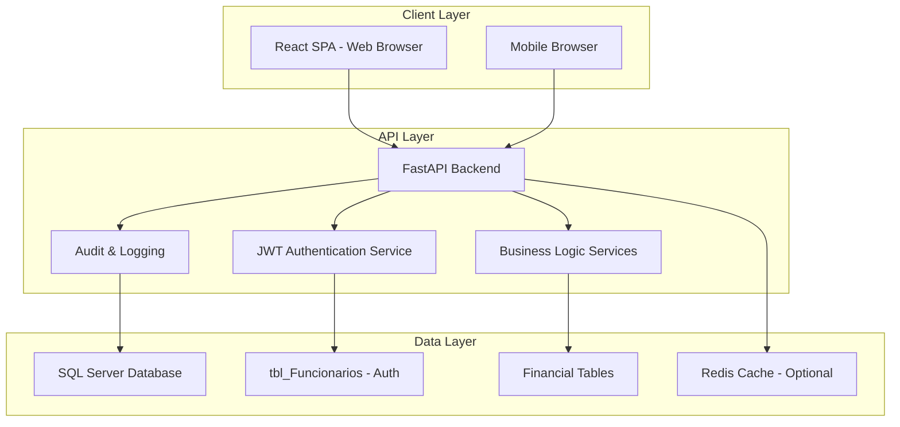
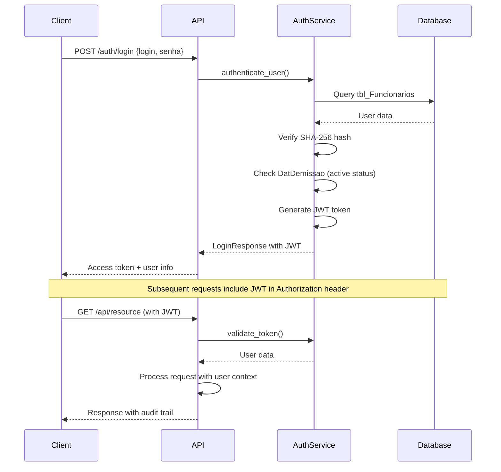
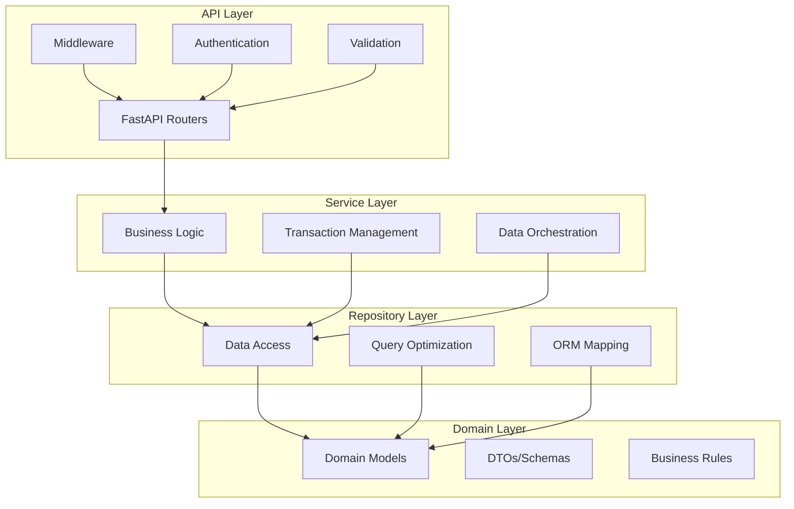
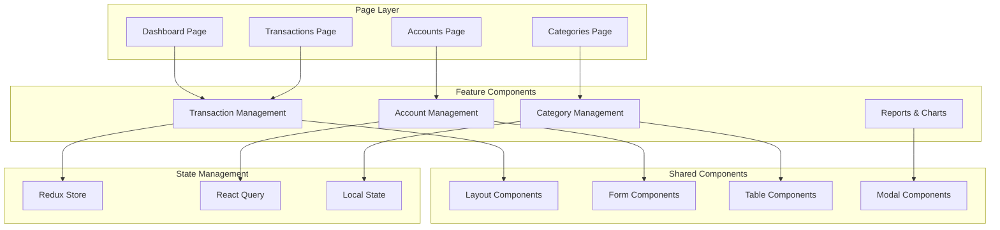
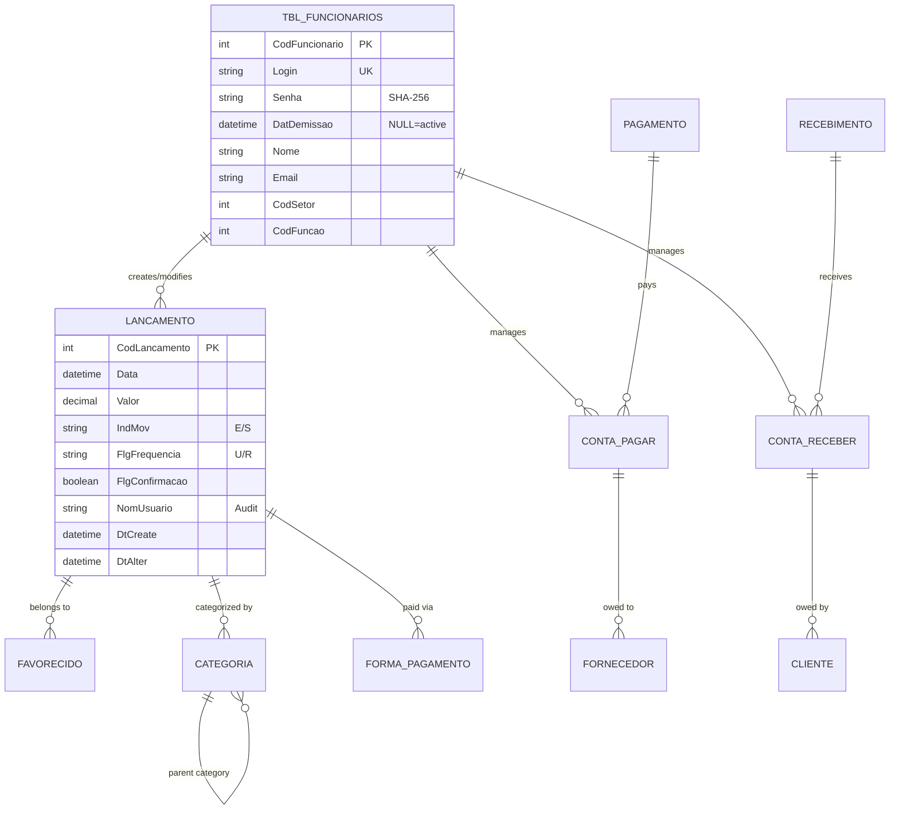
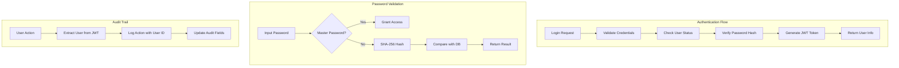
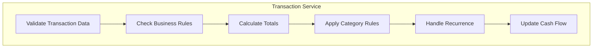
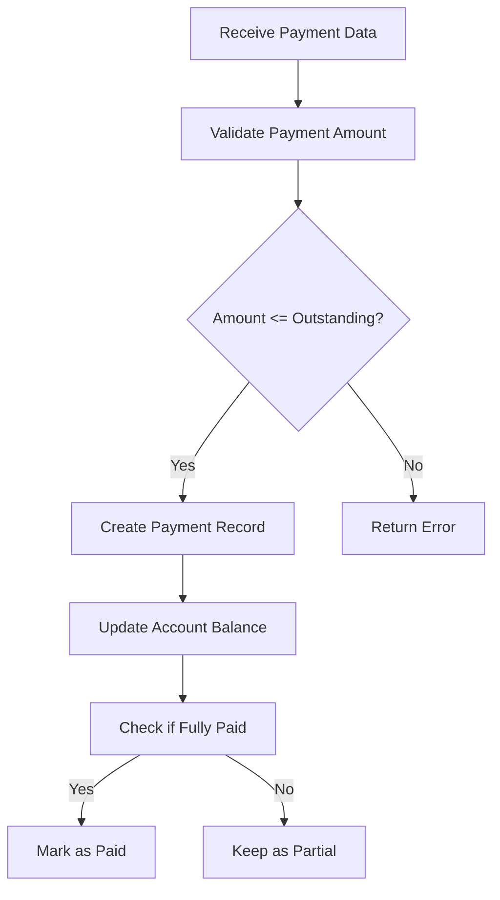
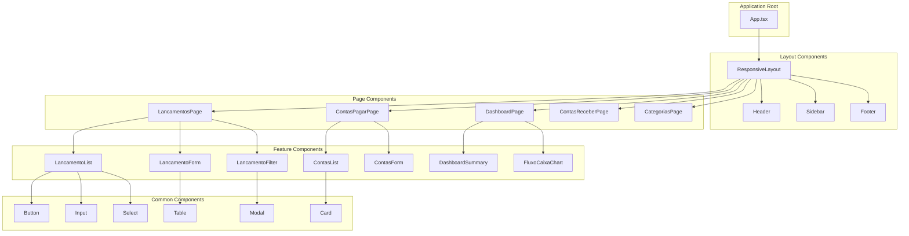

# Financial Web Application Development Design

## Overview

This document outlines the design for developing a comprehensive financial web application for the "Locador" system. The application will provide a modern, responsive interface for managing financial operations including transactions, accounts payable/receivable, categories, and financial reporting.

**Key Requirements Update:**
- Integration with existing `tbl_Funcionarios` table for authentication
- SHA-256 password hashing compatibility with current system
- JWT-based authentication with audit trail
- User audit fields (`IdUserCreate`, `IdUserAlter`, `NomUsuario`) in all financial entities
- Master password support for system administration

## Technology Stack & Dependencies

### Backend Stack
- **Framework**: Python 3.10+ with FastAPI
- **ORM**: SQLAlchemy for database interactions
- **Database**: SQL Server (existing database integration)
- **Authentication**: JWT with SHA-256 password hashing (compatible with existing system)
- **Validation**: Pydantic for data validation and serialization
- **Migrations**: Alembic for database schema management
- **API Documentation**: Swagger/OpenAPI (automatic with FastAPI)
- **Security**: Rate limiting, HTTPS enforcement, audit logging

### Frontend Stack
- **Framework**: React 18+ with TypeScript
- **UI Library**: Material-UI (MUI) for component library
- **State Management**: Redux Toolkit for global state
- **Server State**: React Query for server state management
- **HTTP Client**: Axios for API communication
- **Forms**: React Hook Form with Yup validation
- **Routing**: React Router v6
- **Charts**: Chart.js or Recharts for data visualization

### DevOps & Infrastructure
- **Containerization**: Docker and Docker Compose
- **CI/CD**: GitHub Actions or Azure DevOps
- **Testing**: pytest (backend), Jest/React Testing Library (frontend)

## Architecture

### System Architecture Overview



### Authentication Flow



### Backend Architecture (Layered Architecture)



### Frontend Component Architecture



## Data Models & ORM Mapping

### Authentication Model

#### TblFuncionarios (User Authentication)
```python
class TblFuncionarios(Base):
    __tablename__ = 'tbl_Funcionarios'
    
    CodFuncionario = Column(Integer, primary_key=True, index=True)
    NumCTPS = Column(String(50))
    CPF = Column(String(14))
    Nome = Column(String(100))
    Telefone = Column(String(20))
    Endereco = Column(String(200))
    Salario = Column(DECIMAL(10, 2))
    DatAdmissao = Column(DateTime)
    DatDemissao = Column(DateTime, nullable=True)  # NULL = active user
    FlgComissao = Column(Boolean)
    ValComissao = Column(DECIMAL(5, 2))
    VlrDesconto = Column(DECIMAL(10, 2))
    Email = Column(String(100))
    Login = Column(String(50), unique=True, index=True)
    Senha = Column(String(255))  # SHA-256 hash
    AssinaturaDigitalizada = Column(LargeBinary)
    CodSetor = Column(Integer)
    CodFavorecido = Column(Integer)
    CodFuncao = Column(Integer)
    Settings = Column(String(500))
    Foto = Column(LargeBinary)
    DatCadastro = Column(DateTime, default=datetime.utcnow)
    NomUsuario = Column(String(50), nullable=False)
    DatAlteracao = Column(DateTime)
    NomUsuarioAlteracao = Column(String(50))
    
    def is_active(self) -> bool:
        """Check if employee is active (not dismissed)"""
        return self.DatDemissao is None
```

### Audit Trail Mixins

```python
class UserAuditMixin:
    """Mixin for tables using user ID for audit trail"""
    IdUserCreate = Column(Integer, ForeignKey('tbl_Funcionarios.CodFuncionario'), nullable=False)
    IdUserAlter = Column(Integer, ForeignKey('tbl_Funcionarios.CodFuncionario'), nullable=True)
    DtCreate = Column(DateTime, default=datetime.utcnow, nullable=False)
    DtAlter = Column(DateTime, onupdate=datetime.utcnow, nullable=True)
    
    # Relationships for audit
    user_create = relationship("TblFuncionarios", foreign_keys=[IdUserCreate])
    user_alter = relationship("TblFuncionarios", foreign_keys=[IdUserAlter])

class LoginAuditMixin:
    """Mixin for tables using login for audit trail"""
    NomUsuario = Column(String(50), nullable=False)  # User login
    DtCreate = Column(DateTime, default=datetime.utcnow, nullable=False)
    DtAlter = Column(DateTime, onupdate=datetime.utcnow, nullable=True)
```

### Core Financial Entities

#### Lancamento (Financial Transaction)
```python
class Lancamento(Base, LoginAuditMixin):
    __tablename__ = "tbl_FINLancamentos"
    
    CodLancamento = Column(Integer, primary_key=True)
    Data = Column(DateTime, nullable=False)
    DataEmissao = Column(DateTime, nullable=False)
    CodFavorecido = Column(Integer, ForeignKey("tbl_FINFavorecido.CodFavorecido"))
    CodCategoria = Column(Integer, ForeignKey("tbl_FINCategorias.CodCategoria"))
    Valor = Column(Numeric(18, 2), nullable=False)
    IndMov = Column(String(1), nullable=False)  # E: Entrada, S: Saída
    NumDocto = Column(String(50))
    CodFormaPagto = Column(Integer, ForeignKey("tbl_FINFormaPagamento.CodFormaPagto"))
    FlgConfirmacao = Column(Boolean, default=False)
    FlgFrequencia = Column(String(1), nullable=False)  # U: Único, R: Recorrente
    Observacao = Column(String(500))
    
    # Relationships
    favorecido = relationship("Favorecido", back_populates="lancamentos")
    categoria = relationship("Categoria", back_populates="lancamentos")
    forma_pagamento = relationship("FormaPagamento", back_populates="lancamentos")
```

#### ContaPagar (Accounts Payable)
```python
class ContaPagar(Base, UserAuditMixin):
    __tablename__ = "tbl_AccountsPayable"
    
    CodAccountsPayable = Column(Integer, primary_key=True)
    CodFornecedor = Column(Integer, ForeignKey("tbl_Fornecedor.CodFornecedor"))
    DataEmissao = Column(DateTime, nullable=False)
    DataVencimento = Column(DateTime, nullable=False)
    Valor = Column(Numeric(18, 2), nullable=False)
    ValorPago = Column(Numeric(18, 2), default=0)
    Status = Column(String(1), nullable=False)  # A: Aberto, P: Pago, V: Vencido
    NumeroDocumento = Column(String(50))
    Observacao = Column(String(500))
    
    # Relationships
    fornecedor = relationship("Fornecedor", back_populates="contas_pagar")
    pagamentos = relationship("AccountsPayablePayment", back_populates="conta_pagar")
```

### Entity Relationship Mapping



## API Endpoints Reference

### Authentication Endpoints
```
POST /api/v1/auth/login                     # Login with tbl_Funcionarios credentials
GET  /api/v1/auth/me                        # Get current user info
POST /api/v1/auth/logout                    # Logout (token invalidation)
POST /api/v1/auth/refresh                   # Refresh JWT token
```

#### Authentication Request/Response Schema
```python
class LoginRequest(BaseModel):
    login: str
    senha: str  # Plain text, will be hashed with SHA-256

class LoginResponse(BaseModel):
    access_token: str
    token_type: str = "bearer"
    expires_in: int
    user_info: UserInfo

class UserInfo(BaseModel):
    cod_funcionario: int
    nome: str
    login: str
    email: Optional[str] = None
    cod_setor: Optional[int] = None
    cod_funcao: Optional[int] = None
    is_active: bool
```

### Financial Transactions (Lançamentos)
```
GET    /api/v1/lancamentos/                    # List with filters and pagination
GET    /api/v1/lancamentos/{id}                # Get by ID
POST   /api/v1/lancamentos/                    # Create new transaction
PUT    /api/v1/lancamentos/{id}                # Update transaction
DELETE /api/v1/lancamentos/{id}                # Delete transaction
PATCH  /api/v1/lancamentos/{id}/confirm        # Confirm transaction
```

#### Request/Response Schema
```python
class LancamentoCreate(BaseModel):
    Data: datetime
    DataEmissao: datetime
    CodFavorecido: int
    CodCategoria: int
    Valor: Decimal = Field(..., gt=0)
    IndMov: Literal['E', 'S']
    NumDocto: Optional[str] = None
    CodFormaPagto: int
    FlgFrequencia: Literal['U', 'R']
    Observacao: Optional[str] = None
    # Note: NomUsuario will be auto-populated from JWT token

class LancamentoResponse(LancamentoCreate):
    CodLancamento: int
    FlgConfirmacao: bool
    favorecido_nome: Optional[str]
    categoria_nome: Optional[str]
    forma_pagamento_nome: Optional[str]
    NomUsuario: str  # User who created the record
    DtCreate: datetime
    DtAlter: Optional[datetime]
```

### Accounts Payable
```
GET    /api/v1/contas-pagar/                   # List with filters
GET    /api/v1/contas-pagar/{id}               # Get by ID
POST   /api/v1/contas-pagar/                   # Create new account
PUT    /api/v1/contas-pagar/{id}               # Update account
DELETE /api/v1/contas-pagar/{id}               # Delete account
POST   /api/v1/contas-pagar/{id}/pagamentos    # Add payment
```

### Accounts Receivable
```
GET    /api/v1/contas-receber/                 # List with filters
GET    /api/v1/contas-receber/{id}             # Get by ID
POST   /api/v1/contas-receber/                 # Create new account
PUT    /api/v1/contas-receber/{id}             # Update account
DELETE /api/v1/contas-receber/{id}             # Delete account
POST   /api/v1/contas-receber/{id}/recebimentos # Add receipt
```

### Categories
```
GET    /api/v1/categorias/                     # List all categories
GET    /api/v1/categorias/{id}                 # Get by ID
POST   /api/v1/categorias/                     # Create new category
PUT    /api/v1/categorias/{id}                 # Update category
DELETE /api/v1/categorias/{id}                 # Delete category
```

### Dashboard & Reports
```
GET    /api/v1/dashboard/resumo                # Financial summary
GET    /api/v1/dashboard/fluxo-caixa          # Cash flow data
GET    /api/v1/relatorios/receitas-despesas   # Revenue/Expense report
GET    /api/v1/relatorios/contas-vencer       # Due accounts report
```

### Authentication Requirements
All endpoints except `/auth/login` require:
- Bearer JWT token in Authorization header
- Valid user session (user must be active in tbl_Funcionarios)
- Token contains user identification for audit trail
- Rate limiting for failed authentication attempts

### Security Features
- **Password Hashing**: SHA-256 compatible with existing system
- **Master Password**: Support for system master password override
- **Session Management**: JWT tokens with configurable expiration
- **Audit Trail**: All operations logged with user identification
- **Rate Limiting**: Protection against brute force attacks
- **HTTPS Only**: All communications must be encrypted

## Business Logic Layer

### Authentication Service Architecture



### Authentication Business Rules

1. **User Validation**
   - Login must exist in `tbl_Funcionarios.Login`
   - User must be active (`DatDemissao` is NULL)
   - Password must match SHA-256 hash or be master password

2. **Security Rules**
   - JWT tokens expire after configurable time (default 24 hours)
   - Failed login attempts are logged for security audit
   - Master password: `"YpP7sPnjw2G/TO5357wt1w=="` provides admin access
   - Rate limiting: Max 5 failed attempts per minute per IP

3. **Audit Requirements**
   - All financial operations must include user identification
   - `NomUsuario` field populated with authenticated user's login
   - `IdUserCreate` and `IdUserAlter` populated with user's CodFuncionario
   - Timestamps automatically managed for create/update operations

### Transaction Management Service



#### Core Business Rules
1. **Transaction Validation**
   - Valor must be positive
   - Data cannot be in the future for confirmed transactions
   - Required fields: Data, Valor, CodCategoria, CodFavorecido
   - User context: NomUsuario automatically populated from JWT

2. **Confirmation Rules**
   - Only pending transactions can be confirmed
   - Confirmed transactions update cash flow
   - Confirmed transactions cannot be deleted
   - Confirmation updates audit trail with current user

3. **Recurrence Handling**
   - Recurrent transactions generate future instances
   - Template transactions maintain reference to generated instances
   - Each generated instance includes creating user's audit information

4. **Audit Trail Rules**
   - All create operations populate `NomUsuario` with authenticated user's login
   - All update operations update `DtAlter` timestamp
   - User identification maintained throughout transaction lifecycle

### Account Management Service

#### Payment Processing


#### Due Date Management
- Automatic status updates for overdue accounts
- Notification system for approaching due dates
- Grace period configuration

## Middleware & Interceptors

### Backend Middleware
1. **Authentication Middleware**
   - JWT token validation against `tbl_Funcionarios`
   - User session management with active status check
   - Role-based access control integration
   - Automatic user context injection for audit trail

2. **Audit Middleware**
   - Automatic population of audit fields (`NomUsuario`, `IdUserCreate`, `IdUserAlter`)
   - Request/response logging with user identification
   - Performance monitoring with user context
   - Security event logging

3. **Security Middleware**
   - Rate limiting for authentication endpoints
   - HTTPS enforcement
   - CORS configuration for financial domain
   - Request validation and sanitization

4. **Error Handling Middleware**
   - Global exception handling with user context
   - Standardized error responses
   - Validation error formatting
   - Security-aware error messages (no sensitive data leakage)

### Frontend Interceptors
1. **Request Interceptor**
   - Automatic JWT token attachment from localStorage
   - Request logging with user context
   - Loading state management for financial operations
   - Request timeout handling for slow connections

2. **Response Interceptor**
   - Automatic token refresh when expired
   - Error response processing with user-friendly messages
   - Cache invalidation for real-time financial data
   - Logout handling when user becomes inactive

3. **Security Interceptor**
   - Sensitive data masking in logs
   - Automatic logout on security violations
   - Session timeout handling
   - CSRF protection headers

## Testing Strategy

### Backend Testing

#### Unit Tests (pytest)
```python
class TestAuthService:
    def test_authenticate_valid_user(self):
        # Test successful authentication with valid credentials
        pass
    
    def test_authenticate_master_password(self):
        # Test master password authentication
        pass
    
    def test_authenticate_inactive_user(self):
        # Test rejection of dismissed employees
        pass
    
    def test_authenticate_invalid_password(self):
        # Test password validation failure
        pass
    
    def test_jwt_token_generation(self):
        # Test JWT token creation and validation
        pass

class TestLancamentoService:
    def test_create_lancamento_with_audit(self):
        # Test transaction creation with audit trail
        pass
    
    def test_create_lancamento_invalid_data(self):
        # Test validation errors
        pass
    
    def test_confirm_lancamento_audit_trail(self):
        # Test confirmation with user audit
        pass
    
    def test_lancamento_recurrence_with_user_context(self):
        # Test recurrent transaction generation with user context
        pass
```

#### Integration Tests
- Authentication flow integration with `tbl_Funcionarios`
- Database integration tests with audit trail validation
- API endpoint tests with JWT token validation
- Service layer integration with user context
- Financial operations end-to-end with audit verification

#### Security Tests
- Password hashing compatibility tests
- JWT token security validation
- Rate limiting verification
- Authorization bypass attempts
- Audit trail integrity tests

#### Test Coverage Requirements
- Minimum 80% code coverage
- 100% coverage for business logic
- Critical path testing

### Frontend Testing

#### Component Tests (Jest + React Testing Library)
```typescript
describe('LancamentoForm', () => {
  test('should render form fields correctly', () => {
    // Test component rendering
  });
  
  test('should validate required fields', () => {
    // Test form validation
  });
  
  test('should submit form with valid data', () => {
    // Test form submission
  });
});
```

#### E2E Tests (Cypress)
```typescript
describe('Financial Authentication Flow', () => {
  it('should authenticate with tbl_Funcionarios credentials', () => {
    // Test complete authentication flow
    cy.visit('/login');
    cy.get('[data-cy=login-input]').type('admin');
    cy.get('[data-cy=password-input]').type('password123');
    cy.get('[data-cy=login-button]').click();
    cy.url().should('include', '/dashboard');
    cy.get('[data-cy=user-name]').should('contain', 'Admin User');
  });
  
  it('should reject inactive users', () => {
    // Test dismissed employee rejection
  });
  
  it('should handle master password access', () => {
    // Test master password authentication
  });
});

describe('Financial Transactions with Audit', () => {
  it('should create transaction with user audit trail', () => {
    // Test complete transaction creation with audit
  });
  
  it('should display user information in transaction history', () => {
    // Test audit trail visibility in UI
  });
});
```

### Testing Data Management
- Test database with sample data from `tbl_Funcionarios`
- Factory patterns for test data generation with valid user context
- Mock authentication service with configurable user roles
- Cleanup procedures for test isolation
- Audit trail verification utilities for testing

## Authentication & Security Implementation

### Password Hashing Utility
```typescript
// SHA-256 hashing compatible with existing system
class HashUtil {
  static generateHash(password: string): string {
    return crypto.createHash('sha256').update(password).digest('hex');
  }
  
  static verifyPassword(plainPassword: string, hashedPassword: string): boolean {
    // Check master password first
    const masterPassword = "YpP7sPnjw2G/TO5357wt1w==";
    if (plainPassword === masterPassword) {
      return true;
    }
    
    // Verify against SHA-256 hash
    return this.generateHash(plainPassword) === hashedPassword;
  }
}
```

### JWT Token Management
```typescript
interface JWTPayload {
  sub: string; // CodFuncionario
  login: string;
  nome: string;
  cod_setor?: number;
  cod_funcao?: number;
  exp: number;
  iat: number;
}

class JWTService {
  static createToken(user: TblFuncionarios): string {
    const payload: JWTPayload = {
      sub: user.CodFuncionario.toString(),
      login: user.Login,
      nome: user.Nome,
      cod_setor: user.CodSetor,
      cod_funcao: user.CodFuncao,
      exp: Math.floor(Date.now() / 1000) + (24 * 60 * 60), // 24 hours
      iat: Math.floor(Date.now() / 1000)
    };
    
    return jwt.sign(payload, process.env.JWT_SECRET);
  }
  
  static verifyToken(token: string): JWTPayload {
    return jwt.verify(token, process.env.JWT_SECRET) as JWTPayload;
  }
}
```

### Frontend Authentication Integration

#### Login Component with tbl_Funcionarios
```typescript
interface LoginFormData {
  login: string;
  senha: string;
}

const LoginPage: React.FC = () => {
  const [loginForm] = useForm<LoginFormData>();
  const navigate = useNavigate();
  const [isLoading, setIsLoading] = useState(false);
  const [error, setError] = useState<string | null>(null);
  
  const handleLogin = async (data: LoginFormData) => {
    setIsLoading(true);
    setError(null);
    
    try {
      const response = await authService.login(data);
      
      // Store JWT token
      localStorage.setItem('access_token', response.access_token);
      localStorage.setItem('user_info', JSON.stringify(response.user_info));
      
      // Redirect to dashboard
      navigate('/dashboard');
    } catch (error: any) {
      setError(error.response?.data?.detail || 'Erro ao fazer login');
    } finally {
      setIsLoading(false);
    }
  };
  
  return (
    <Box component="form" onSubmit={loginForm.handleSubmit(handleLogin)}>
      <Typography variant="h4" gutterBottom>
        Sistema Financeiro Locador
      </Typography>
      
      <TextField
        {...loginForm.register('login', { required: 'Login é obrigatório' })}
        label="Login"
        fullWidth
        margin="normal"
        error={!!loginForm.formState.errors.login}
        helperText={loginForm.formState.errors.login?.message}
      />
      
      <TextField
        {...loginForm.register('senha', { required: 'Senha é obrigatória' })}
        label="Senha"
        type="password"
        fullWidth
        margin="normal"
        error={!!loginForm.formState.errors.senha}
        helperText={loginForm.formState.errors.senha?.message}
      />
      
      {error && (
        <Alert severity="error" sx={{ mt: 2 }}>
          {error}
        </Alert>
      )}
      
      <Button
        type="submit"
        fullWidth
        variant="contained"
        sx={{ mt: 3, mb: 2 }}
        disabled={isLoading}
      >
        {isLoading ? <CircularProgress size={24} /> : 'Entrar'}
      </Button>
    </Box>
  );
};
```

#### User Context Provider
```typescript
interface UserContextType {
  user: UserInfo | null;
  isAuthenticated: boolean;
  login: (credentials: LoginFormData) => Promise<void>;
  logout: () => void;
  isLoading: boolean;
}

const UserContext = createContext<UserContextType | undefined>(undefined);

export const UserProvider: React.FC<{ children: ReactNode }> = ({ children }) => {
  const [user, setUser] = useState<UserInfo | null>(null);
  const [isLoading, setIsLoading] = useState(true);
  
  useEffect(() => {
    // Check for existing token on app load
    const token = localStorage.getItem('access_token');
    const userInfo = localStorage.getItem('user_info');
    
    if (token && userInfo) {
      try {
        setUser(JSON.parse(userInfo));
      } catch (error) {
        console.error('Invalid user info in localStorage');
        logout();
      }
    }
    
    setIsLoading(false);
  }, []);
  
  const login = async (credentials: LoginFormData) => {
    const response = await authService.login(credentials);
    
    localStorage.setItem('access_token', response.access_token);
    localStorage.setItem('user_info', JSON.stringify(response.user_info));
    
    setUser(response.user_info);
  };
  
  const logout = () => {
    localStorage.removeItem('access_token');
    localStorage.removeItem('user_info');
    setUser(null);
  };
  
  const value = {
    user,
    isAuthenticated: !!user,
    login,
    logout,
    isLoading
  };
  
  return <UserContext.Provider value={value}>{children}</UserContext.Provider>;
};

export const useAuth = () => {
  const context = useContext(UserContext);
  if (context === undefined) {
    throw new Error('useAuth must be used within a UserProvider');
  }
  return context;
};
```

### React Component Hierarchy



### Component Props & State Management

#### LancamentoList Component
```typescript
interface LancamentoListProps {
  filters?: LancamentoFilters;
  onEdit: (lancamento: Lancamento) => void;
  onDelete: (id: number) => void;
  onConfirm: (id: number) => void;
}

interface LancamentoListState {
  lancamentos: Lancamento[];
  loading: boolean;
  error: string | null;
  pagination: PaginationState;
}
```

#### LancamentoForm Component
```typescript
interface LancamentoFormProps {
  lancamento?: Lancamento;
  onSubmit: (data: LancamentoCreate | LancamentoUpdate) => void;
  onCancel: () => void;
  isEditing?: boolean;
}

interface FormState {
  isSubmitting: boolean;
  validationErrors: Record<string, string>;
  isDirty: boolean;
}
```

### Lifecycle Methods/Hooks

#### Custom Hooks for Data Management
```typescript
// useLancamentos Hook
const useLancamentos = (filters?: LancamentoFilters) => {
  const { data, isLoading, error, refetch } = useQuery(
    ['lancamentos', filters],
    () => getLancamentos(filters)
  );
  
  const createMutation = useMutation(createLancamento);
  const updateMutation = useMutation(updateLancamento);
  const deleteMutation = useMutation(deleteLancamento);
  
  return {
    lancamentos: data || [],
    isLoading,
    error,
    refetch,
    createLancamento: createMutation.mutate,
    updateLancamento: updateMutation.mutate,
    deleteLancamento: deleteMutation.mutate
  };
};
```

## Routing & Navigation

### Route Structure
```typescript
const routes = [
  {
    path: '/',
    element: <DashboardPage />,
    protected: true
  },
  {
    path: '/dashboard',
    element: <DashboardPage />,
    protected: true
  },
  {
    path: '/lancamentos',
    element: <LancamentosPage />,
    protected: true
  },
  {
    path: '/contas-pagar',
    element: <ContasPagarPage />,
    protected: true
  },
  {
    path: '/contas-receber',
    element: <ContasReceberPage />,
    protected: true
  },
  {
    path: '/categorias',
    element: <CategoriasPage />,
    protected: true
  },
  {
    path: '/login',
    element: <LoginPage />,
    protected: false
  }
];
```

### Navigation Menu Structure

```mermaid
graph TB
    A[Dashboard] --> A1[Financial Summary]
    A --> A2[Cash Flow Chart]
    A --> A3[Quick Actions]
    
    B[Lançamentos] --> B1[Lista de Lançamentos]
    B --> B2[Novo Lançamento]
    B --> B3[Lançamentos Recorrentes]
    
    C[Contas a Pagar] --> C1[Lista de Contas]
    C --> C2[Nova Conta]
    C --> C3[Contas Vencidas]
    C --> C4[Relatório de Pagamentos]
    
    D[Contas a Receber] --> D1[Lista de Contas]
    D --> D2[Nova Conta]
    D --> D3[Contas Vencidas]
    D --> D4[Relatório de Recebimentos]
    
    E[Categorias] --> E1[Lista de Categorias]
    E --> E2[Nova Categoria]
    E --> E3[Hierarquia de Categorias]
    
    F[Relatórios] --> F1[Fluxo de Caixa]
    F --> F2[Receitas x Despesas]
    F --> F3[Análise por Categoria]
```


## Styling Strategy

### Material-UI Theme Configuration
```typescript
const theme = createTheme({
  palette: {
    primary: {
      main: '#1976d2',
      light: '#42a5f5',
      dark: '#1565c0'
    },
    secondary: {
      main: '#dc004e',
      light: '#ff4569',
      dark: '#9a0036'
    },
    background: {
      default: '#f5f5f5',
      paper: '#ffffff'
    }
  },
  typography: {
    fontFamily: '"Roboto", "Helvetica", "Arial", sans-serif',
    h4: {
      fontWeight: 600
    }
  },
  breakpoints: {
    values: {
      xs: 0,
      sm: 600,
      md: 960,
      lg: 1280,
      xl: 1920
    }
  }
});
```

### Responsive Design Breakpoints
```css
/* Mobile First Approach */
@media (max-width: 600px) {
  .container {
    padding: 8px;
  }
  
  .table-container {
    overflow-x: auto;
  }
  
  .hide-on-mobile {
    display: none;
  }
}

@media (min-width: 601px) and (max-width: 960px) {
  .container {
    padding: 16px;
  }
  
  .dashboard-grid {
    grid-template-columns: repeat(2, 1fr);
  }
}

@media (min-width: 961px) {
  .container {
    padding: 24px;
  }
  
  .dashboard-grid {
    grid-template-columns: repeat(4, 1fr);
  }
}
```

## State Management

### Redux Store Structure
```typescript
interface RootState {
  auth: AuthState;
  ui: UIState;
  preferences: PreferencesState;
}

interface AuthState {
  user: User | null;
  token: string | null;
  isAuthenticated: boolean;
  isLoading: boolean;
}

interface UIState {
  sidebarOpen: boolean;
  theme: 'light' | 'dark';
  notifications: Notification[];
}

interface PreferencesState {
  dateFormat: string;
  currency: string;
  pageSize: number;
}
```

### React Query for Server State
```typescript
// Query Keys
const queryKeys = {
  lancamentos: ['lancamentos'] as const,
  lancamentoDetail: (id: number) => ['lancamentos', id] as const,
  contas: ['contas'] as const,
  categorias: ['categorias'] as const,
  dashboard: ['dashboard'] as const
};

// Query Client Configuration
const queryClient = new QueryClient({
  defaultOptions: {
    queries: {
      staleTime: 5 * 60 * 1000, // 5 minutes
      retry: 3,
      refetchOnWindowFocus: false
    },
    mutations: {
      retry: 1
    }
  }
});
```

## API Integration Layer

### HTTP Client Configuration
```typescript
// API Client Setup
const apiClient = axios.create({
  baseURL: process.env.REACT_APP_API_URL || 'http://localhost:8000/api/v1',
  timeout: 10000,
  headers: {
    'Content-Type': 'application/json'
  }
});

// Request Interceptor
apiClient.interceptors.request.use(
  (config) => {
    const token = localStorage.getItem('access_token');
    if (token) {
      config.headers.Authorization = `Bearer ${token}`;
    }
    return config;
  },
  (error) => Promise.reject(error)
);

// Response Interceptor
apiClient.interceptors.response.use(
  (response) => response,
  async (error) => {
    if (error.response?.status === 401) {
      // Handle token refresh or redirect to login
      const refreshed = await refreshToken();
      if (refreshed) {
        return apiClient.request(error.config);
      } else {
        redirectToLogin();
      }
    }
    return Promise.reject(error);
  }
);
```

### Service Layer Implementation
```typescript
class LancamentoService {
  async getLancamentos(filters?: LancamentoFilters): Promise<Lancamento[]> {
    const response = await apiClient.get('/lancamentos', { params: filters });
    return response.data;
  }
  
  async createLancamento(data: LancamentoCreate): Promise<Lancamento> {
    const response = await apiClient.post('/lancamentos', data);
    return response.data;
  }
  
  async updateLancamento(id: number, data: LancamentoUpdate): Promise<Lancamento> {
    const response = await apiClient.put(`/lancamentos/${id}`, data);
    return response.data;
  }
  
  async deleteLancamento(id: number): Promise<void> {
    await apiClient.delete(`/lancamentos/${id}`);
  }
  
  async confirmLancamento(id: number): Promise<Lancamento> {
    const response = await apiClient.patch(`/lancamentos/${id}/confirm`);
    return response.data;
  }
}
```