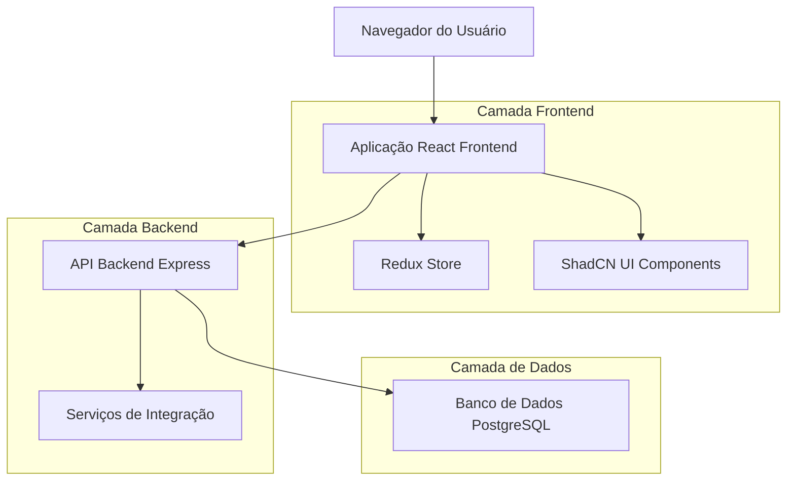
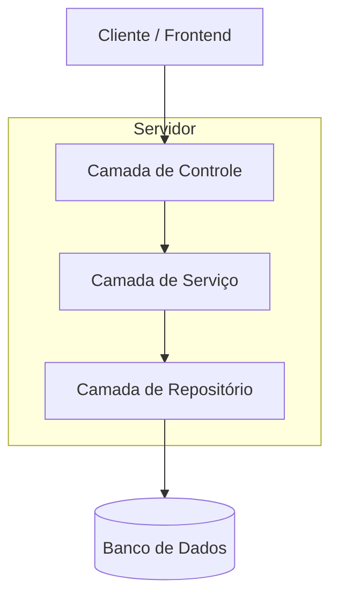
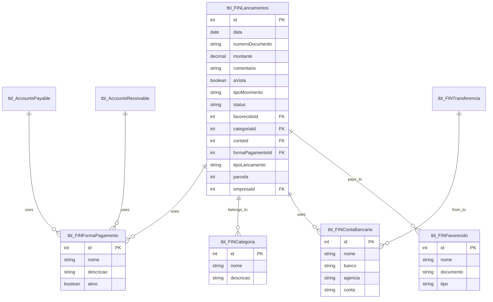

# Lançamentos do Dia - Documento de Arquitetura Técnica

## 1. Design da Arquitetura



## 2. Descrição das Tecnologias

- Frontend: React@18 + TypeScript + ShadCN UI + TailwindCSS + Vite
- Backend: Express.js + Node.js
- Estado: Redux Toolkit + RTK Query
- Gráficos: Recharts
- Datas: date-fns
- Banco de Dados: PostgreSQL

## 3. Definições de Rotas

| Rota | Propósito |
|------|----------|
| /lancamentos-do-dia | Página principal de consulta de lançamentos do dia |
| /lancamentos/novo | Modal/página para criar novo lançamento |
| /contas-pagar/nova | Modal/página para criar nova conta a pagar |
| /contas-receber/nova | Modal/página para criar nova conta a receber |
| /transferencias/nova | Modal/página para criar nova transferência |

## 4. Definições de API

### 4.1 APIs Principais

**Consulta de lançamentos do dia**
```
GET /api/lancamentos/dia
```

Request:
| Nome do Parâmetro | Tipo | Obrigatório | Descrição |
|-------------------|------|-------------|----------|
| data | string | true | Data no formato YYYY-MM-DD |
| valorMin | number | false | Valor mínimo para filtro |
| valorMax | number | false | Valor máximo para filtro |
| favorecidoId | number | false | ID do favorecido |
| categoriaId | number | false | ID da categoria |
| contaId | number | false | ID da conta bancária |
| tipoLancamento | string | false | Tipo: TODOS, LANCAMENTOS, TRANSFERENCIAS, CONTAS_PAGAR, CONTAS_RECEBER |
| numeroDocumento | string | false | Número do documento |
| formaPagamentoId | number | false | ID da forma de pagamento |

Response:
| Nome do Parâmetro | Tipo | Descrição |
|-------------------|------|----------|
| lancamentos | array | Lista de lançamentos |
| resumo | object | Totais consolidados |
| graficoFormasPagamento | array | Dados para gráfico de pizza |

Exemplo:
```json
{
  "lancamentos": [
    {
      "id": 1,
      "aVista": true,
      "tipoMovimento": "Débito",
      "data": "2025-01-18",
      "numeroDocumento": "77268",
      "favorecido": "F-CONSORCIAL SANTO ANTONIO EMPREEND",
      "comentario": "MEDIÇÃO DE FATURAS",
      "categoria": "ALUGUEL DE EQUIP",
      "conta": "BBM B. BRASIL BOLETO",
      "montante": 7396.00,
      "formaPagamento": "BOLETO BANCÁRIO",
      "status": "Pendente",
      "tipoLancamento": "Medição",
      "parcela": "1",
      "empresa": "BBM LOCAÇÃO"
    }
  ],
  "resumo": {
    "totalEntradas": 15000.00,
    "totalSaidas": 8000.00,
    "saldoDia": 7000.00,
    "totalPendente": 3000.00
  },
  "graficoFormasPagamento": [
    {
      "nome": "BOLETO BANCÁRIO",
      "valor": 25000.00,
      "percentual": 45.5
    }
  ]
}
```

**Confirmar pagamentos múltiplos**
```
POST /api/lancamentos/confirmar-multiplos
```

Request:
| Nome do Parâmetro | Tipo | Obrigatório | Descrição |
|-------------------|------|-------------|----------|
| lancamentoIds | array | true | Array de IDs dos lançamentos |
| dataConfirmacao | string | true | Data de confirmação |

**Exportar para Excel**
```
GET /api/lancamentos/exportar-excel
```

Request: Mesmos parâmetros da consulta principal
Response: Arquivo Excel para download

## 5. Diagrama da Arquitetura do Servidor



## 6. Modelo de Dados

### 6.1 Definição do Modelo de Dados



### 6.2 Linguagem de Definição de Dados

**View unificada para consulta de lançamentos do dia**
```sql
-- Criar view unificada para lançamentos do dia
CREATE OR REPLACE VIEW vw_lancamentos_dia AS
SELECT 
    'LANCAMENTO' as origem,
    l.id,
    l.aVista,
    l.tipoMovimento,
    l.data,
    l.numeroDocumento,
    f.nome as favorecido,
    l.comentario,
    c.nome as categoria,
    cb.nome as conta,
    l.montante,
    fp.nome as formaPagamento,
    l.status,
    l.tipoLancamento,
    l.parcela,
    e.nome as empresa
FROM tbl_FINLancamentos l
LEFT JOIN tbl_FINFavorecido f ON l.favorecidoId = f.id
LEFT JOIN tbl_FINCategoria c ON l.categoriaId = c.id
LEFT JOIN tbl_FINContaBancaria cb ON l.contaId = cb.id
LEFT JOIN tbl_FINFormaPagamento fp ON l.formaPagamentoId = fp.id
LEFT JOIN tbl_Empresa e ON l.empresaId = e.id

UNION ALL

SELECT 
    'CONTA_PAGAR' as origem,
    ap.id,
    ap.aVista,
    'Débito' as tipoMovimento,
    ap.dataVencimento as data,
    ap.numeroDocumento,
    ap.fornecedor as favorecido,
    ap.descricao as comentario,
    ap.categoria,
    cb.nome as conta,
    ap.valor as montante,
    fp.nome as formaPagamento,
    ap.status,
    'Conta a Pagar' as tipoLancamento,
    ap.parcela,
    e.nome as empresa
FROM tbl_AccountsPayable ap
LEFT JOIN tbl_FINContaBancaria cb ON ap.contaId = cb.id
LEFT JOIN tbl_FINFormaPagamento fp ON ap.formaPagamentoId = fp.id
LEFT JOIN tbl_Empresa e ON ap.empresaId = e.id

UNION ALL

SELECT 
    'CONTA_RECEBER' as origem,
    ar.id,
    ar.aVista,
    'Crédito' as tipoMovimento,
    ar.dataVencimento as data,
    ar.numeroDocumento,
    ar.cliente as favorecido,
    ar.descricao as comentario,
    ar.categoria,
    cb.nome as conta,
    ar.valor as montante,
    fp.nome as formaPagamento,
    ar.status,
    'Conta a Receber' as tipoLancamento,
    ar.parcela,
    e.nome as empresa
FROM tbl_AccountsReceivable ar
LEFT JOIN tbl_FINContaBancaria cb ON ar.contaId = cb.id
LEFT JOIN tbl_FINFormaPagamento fp ON ar.formaPagamentoId = fp.id
LEFT JOIN tbl_Empresa e ON ar.empresaId = e.id

UNION ALL

SELECT 
    'TRANSFERENCIA' as origem,
    t.id,
    true as aVista,
    'Transferência' as tipoMovimento,
    t.data,
    t.numeroDocumento,
    CONCAT(cb_origem.nome, ' → ', cb_destino.nome) as favorecido,
    t.descricao as comentario,
    'Transferência' as categoria,
    cb_origem.nome as conta,
    t.valor as montante,
    'Transferência Bancária' as formaPagamento,
    'Confirmado' as status,
    'Transferência' as tipoLancamento,
    1 as parcela,
    e.nome as empresa
FROM tbl_FINTransferencia t
LEFT JOIN tbl_FINContaBancaria cb_origem ON t.contaOrigemId = cb_origem.id
LEFT JOIN tbl_FINContaBancaria cb_destino ON t.contaDestinoId = cb_destino.id
LEFT JOIN tbl_Empresa e ON t.empresaId = e.id;

-- Índices para otimização
CREATE INDEX idx_lancamentos_data ON tbl_FINLancamentos(data);
CREATE INDEX idx_accounts_payable_data ON tbl_AccountsPayable(dataVencimento);
CREATE INDEX idx_accounts_receivable_data ON tbl_AccountsReceivable(dataVencimento);
CREATE INDEX idx_transferencia_data ON tbl_FINTransferencia(data);
```