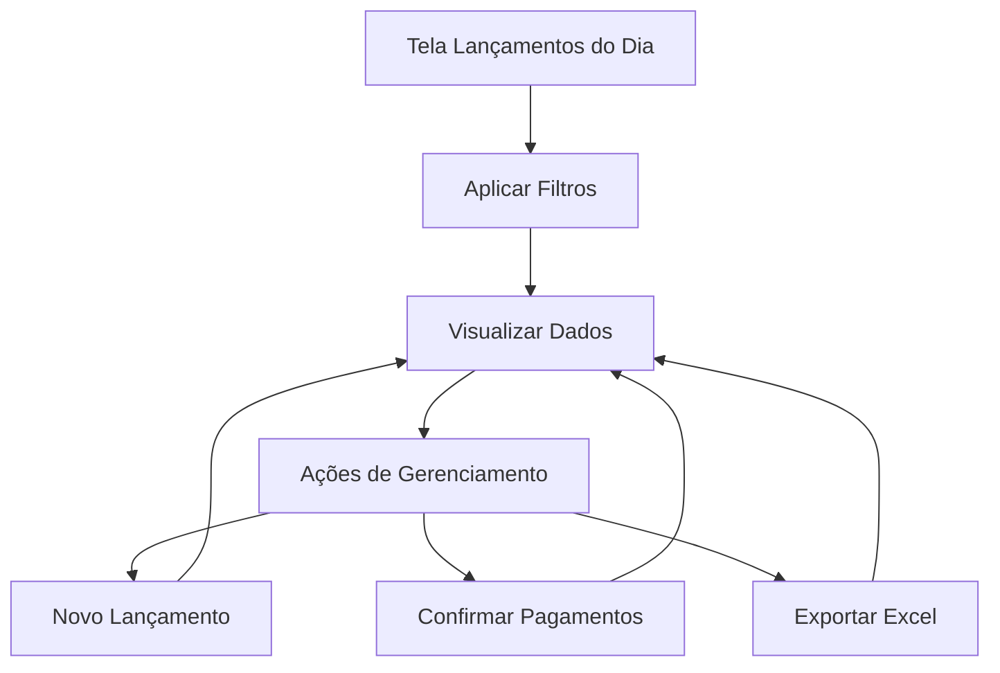

# Lançamentos do Dia - Documento de Requisitos do Produto

## 1. Visão Geral do Produto

Tela de consulta unificada que permite visualizar e gerenciar todos os lançamentos financeiros de uma data específica, consolidando informações de lançamentos, contas a pagar, contas a receber e transferências em uma única interface.

O produto resolve a necessidade de ter uma visão consolidada diária das movimentações financeiras, permitindo aos usuários acompanhar, filtrar e gerenciar todas as transações de forma centralizada.

## 2. Funcionalidades Principais

### 2.1 Papéis de Usuário

| Papel | Método de Registro | Permissões Principais |
|-------|-------------------|----------------------|
| Usuário Financeiro | Login do sistema existente | Visualizar, criar e editar lançamentos, confirmar pagamentos |
| Administrador | Login do sistema existente | Todas as permissões + excluir lançamentos e exportar dados |

### 2.2 Módulo de Funcionalidades

Nossos requisitos para Lançamentos do Dia consistem nas seguintes páginas principais:

1. **Página Principal de Lançamentos do Dia**: filtros avançados, tabela de dados, resumo consolidado, gráfico de formas de pagamento, botões de ação.

### 2.3 Detalhes das Páginas

| Nome da Página | Nome do Módulo | Descrição da Funcionalidade |
|----------------|----------------|-----------------------------|
| Lançamentos do Dia | Filtros de Consulta | Filtrar por data, valor (de/até), favorecido, categoria, conta bancária, tipo de lançamento, número do documento, forma de pagamento |
| Lançamentos do Dia | Tabela de Dados | Exibir colunas: À vista, Tipo de Movimento, Data, Número do Documento, Favorecido, Comentário, Categoria, Conta, Montante, Forma de Pagamento, Status, Tipo de Lançamento, Parcela, Empresa |
| Lançamentos do Dia | Resumo Consolidado | Calcular e exibir totais por tipo de lançamento, saldo do dia, valores pendentes |
| Lançamentos do Dia | Gráfico de Pizza | Visualizar distribuição de valores por forma de pagamento |
| Lançamentos do Dia | Botões de Ação | Novo Lançamento, Nova Conta a Pagar, Nova Conta a Receber, Nova Transferência, Confirmar Pagamentos, Excluir Lançamento, Confirmar Lançamento, Exportar Excel |
| Lançamentos do Dia | Calendário de Data | Seleção interativa da data de consulta com inicialização na data atual |

## 3. Processo Principal

Fluxo do Usuário Principal:
1. Usuário acessa a tela "Lançamentos do Dia"
2. Sistema carrega automaticamente os lançamentos da data atual
3. Usuário pode alterar a data ou aplicar filtros adicionais
4. Sistema atualiza a tabela, resumo e gráfico conforme os filtros
5. Usuário pode realizar ações como criar novos lançamentos, confirmar pagamentos ou exportar dados
6. Sistema processa as ações e atualiza a visualização

## 4. Design da Interface do Usuário

### 4.1 Estilo de Design

- **Cores primárias**: Azul (#3B82F6) e Verde (#10B981)
- **Cores secundárias**: Cinza (#6B7280) e Branco (#FFFFFF)
- **Estilo de botões**: Arredondados com sombra sutil
- **Fonte**: Inter, tamanhos 12px-16px
- **Estilo de layout**: Card-based com navegação superior
- **Ícones**: Lucide React icons para consistência

### 4.2 Visão Geral do Design das Páginas

| Nome da Página | Nome do Módulo | Elementos da UI |
|----------------|----------------|----------------|
| Lançamentos do Dia | Filtros | Cards com inputs organizados em grid responsivo, comboboxes com busca, date picker com calendário |
| Lançamentos do Dia | Tabela | DataTable com ordenação, paginação, seleção múltipla, cores condicionais por status |
| Lançamentos do Dia | Resumo | Cards com ícones, valores formatados em moeda, indicadores visuais de crescimento |
| Lançamentos do Dia | Gráfico | Gráfico de pizza responsivo com legendas interativas, cores diferenciadas por forma de pagamento |
| Lançamentos do Dia | Botões de Ação | Toolbar com botões primários e secundários, tooltips explicativos |

### 4.3 Responsividade

O produto é desktop-first com adaptação para tablets. Layout em grid que se reorganiza em telas menores, com filtros colapsáveis e tabela com scroll horizontal quando necessário.