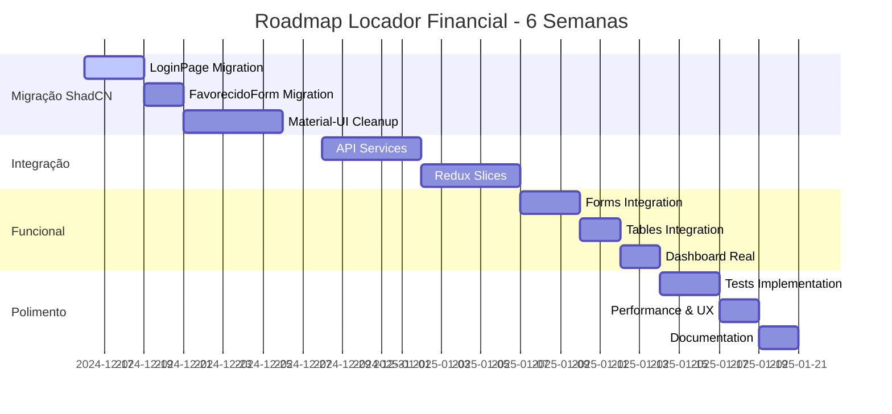

# Roadmap e Próximas Ações - Locador Financial 2024

## 🎯 Objetivo: Finalizar Projeto em 6 Semanas

### Status Atual: **85%** Completo
### Meta: **100%** até Final de Janeiro 2025

---

## 📋 RESUMO EXECUTIVO DAS PENDÊNCIAS

### Situação Identificada
Após análise minuciosa, o projeto está **muito mais avançado** do que documentado. A migração ShadCN UI foi **amplamente implementada** com sucesso, mas há uma **coexistência híbrida** com Material-UI que precisa ser resolvida.

### Principais Gaps Identificados
1. **Limpeza Material-UI** (5% do projeto)
2. **Integração Frontend-Backend** (8% do projeto)
3. **Polimento e Testes** (2% do projeto)

---

## 🚀 PLANO DE AÇÃO DETALHADO

### **SEMANA 1-2: Finalização Migração ShadCN UI**

#### 🎯 Objetivo: Remover Material-UI completamente

##### Dia 1-3: Migração dos Componentes Restantes
- [ ] **LoginPage.tsx**
  - Migrar de Material-UI para ShadCN
  - Manter funcionalidade de autenticação
  - Testar integração com Redux
  - **Tempo estimado:** 4 horas

- [ ] **FavorecidoForm.tsx**
  - Aplicar padrão dos outros formulários ShadCN
  - Validação com Yup
  - Integração React Hook Form
  - **Tempo estimado:** 3 horas

##### Dia 4-5: Revisão de Layout Components
- [ ] **Sidebar.tsx e Layout.tsx**
  - Verificar uso consistente de ShadCN
  - Remover imports Material-UI restantes
  - Implementar tema dark/light se necessário
  - **Tempo estimado:** 2 horas

##### Dia 6-10: Limpeza Completa
- [ ] **Remover Dependências Material-UI**
  ```bash
  npm uninstall @mui/material @mui/icons-material @emotion/react @emotion/styled @mui/system @mui/x-data-grid @mui/x-date-pickers
  ```
  - **Tempo estimado:** 1 hora

- [ ] **Limpar Imports**
  - Buscar e remover todos os imports Material-UI
  - Substituir por equivalentes ShadCN
  - **Tempo estimado:** 2 horas

- [ ] **Padronização de Ícones**
  - Migrar completamente para Lucide React
  - Remover Material Icons
  - Verificar consistência visual
  - **Tempo estimado:** 2 horas

#### ✅ Critérios de Sucesso Semana 1-2
- ✅ Zero dependências Material-UI no package.json
- ✅ Todos os componentes usando ShadCN UI
- ✅ Build sem erros
- ✅ Funcionalidade mantida
- ✅ Tema consistente

---

### **SEMANA 3-4: Integração Frontend-Backend**

#### 🎯 Objetivo: Conectar completamente frontend com APIs

##### Dia 11-15: Implementação de API Services
- [ ] **LancamentoService**
  ```typescript
  // Implementar:
  - fetchLancamentos()
  - createLancamento()
  - updateLancamento()
  - deleteLancamento()
  - confirmarLancamento()
  ```
  - **Tempo estimado:** 6 horas

- [ ] **CategoriaService**
  ```typescript
  // Implementar:
  - fetchCategorias()
  - createCategoria()
  - updateCategoria()
  - deleteCategoria()
  - moverCategoria()
  ```
  - **Tempo estimado:** 4 horas

- [ ] **ClienteService**
  ```typescript
  // Implementar:
  - fetchClientes()
  - createCliente()
  - updateCliente()
  - deleteCliente()
  ```
  - **Tempo estimado:** 4 horas

##### Dia 16-20: Redux Slices Completos
- [ ] **lancamentosSlice**
  - Estado para lançamentos
  - Actions async com createAsyncThunk
  - Reducers para CRUD
  - **Tempo estimado:** 4 horas

- [ ] **categoriasSlice**
  - Estado hierárquico para categorias
  - Actions para movimentação
  - Cache inteligente
  - **Tempo estimado:** 4 horas

- [ ] **clientesSlice**
  - Estado para clientes
  - Filtros e paginação
  - **Tempo estimado:** 3 horas

- [ ] **dashboardSlice**
  - Métricas calculadas
  - Cache de dados agregados
  - **Tempo estimado:** 3 horas

#### ✅ Critérios de Sucesso Semana 3-4
- ✅ Todos os services implementados
- ✅ Redux slices funcionais
- ✅ Cache com React Query
- ✅ Tratamento de erros padronizado

---

### **SEMANA 5: Integração Completa e Funcional**

#### 🎯 Objetivo: Sistema completamente funcional

##### Dia 21-25: Conectar Formulários com APIs
- [ ] **Integrar Formulários**
  - LancamentoForm → LancamentoService
  - CategoriaForm → CategoriaService
  - ClienteForm → ClienteService
  - ContaPagarForm → ContaPagarService
  - **Tempo estimado:** 8 horas

- [ ] **Integrar Tabelas**
  - LancamentosTable → Redux + API
  - CategoriasTable → Redux + API
  - ClientesTable → Redux + API
  - **Tempo estimado:** 6 horas

- [ ] **Dashboard Real**
  - Substituir dados mockados
  - Gráficos com dados reais
  - Métricas calculadas
  - **Tempo estimado:** 4 horas

#### ✅ Critérios de Sucesso Semana 5
- ✅ CRUD completo funcionando
- ✅ Dashboard com dados reais
- ✅ Navegação fluida
- ✅ Estados de loading
- ✅ Tratamento de erros

---

### **SEMANA 6: Polimento e Finalização**

#### 🎯 Objetivo: Produto pronto para produção

##### Dia 26-30: Testes e Qualidade
- [ ] **Testes Unitários Críticos**
  - Componentes principais
  - Services
  - Redux slices
  - **Tempo estimado:** 6 horas

- [ ] **Testes de Integração**
  - Fluxos principais
  - API integration
  - **Tempo estimado:** 4 horas

- [ ] **Performance e UX**
  - Otimização de carregamento
  - Lazy loading
  - Animações suaves
  - Estados vazios
  - **Tempo estimado:** 4 horas

- [ ] **Documentação Final**
  - Atualizar documentação técnica
  - Guia de componentes
  - Manual de deployment
  - **Tempo estimado:** 4 horas

#### ✅ Critérios de Sucesso Semana 6
- ✅ Testes básicos implementados
- ✅ Performance otimizada
- ✅ UX polida
- ✅ Documentação atualizada
- ✅ Build de produção funcional

---

## 📊 CRONOGRAMA VISUAL



---

## 🎯 MÉTRICAS DE ACOMPANHAMENTO

### Semana 1-2: Migração ShadCN
- **Meta:** 0 dependências Material-UI
- **Métrica:** `npm ls | grep @mui` deve retornar vazio
- **Validação:** Build sem warnings

### Semana 3-4: Integração
- **Meta:** 100% services implementados
- **Métrica:** Cobertura de testes > 60%
- **Validação:** APIs respondendo corretamente

### Semana 5: Funcional
- **Meta:** CRUD completo funcionando
- **Métrica:** Todos os formulários salvando
- **Validação:** Dashboard com dados reais

### Semana 6: Produção
- **Meta:** Performance Lighthouse > 85
- **Métrica:** 0 erros console
- **Validação:** Deploy funcional

---

## 🚨 RISCOS E MITIGAÇÕES

### Risco 1: Conflitos na Migração ShadCN
**Probabilidade:** Baixa
**Impacto:** Médio
**Mitigação:** Testar cada componente isoladamente

### Risco 2: Problemas de Integração API
**Probabilidade:** Média
**Impacto:** Alto
**Mitigação:** Implementar testes de integração primeiro

### Risco 3: Performance Issues
**Probabilidade:** Baixa
**Impacto:** Médio
**Mitigação:** Monitoramento contínuo com Lighthouse

---

## 👥 RECURSOS NECESSÁRIOS

### Desenvolvedor Frontend
- **Tempo:** 40 horas/semana por 6 semanas
- **Foco:** Migração ShadCN, integração, UX

### Desenvolvedor Backend (Suporte)
- **Tempo:** 10 horas/semana por 6 semanas
- **Foco:** Ajustes de API, testes de integração

### QA/Tester
- **Tempo:** 15 horas nas últimas 2 semanas
- **Foco:** Testes funcionais, validação

---

## 🎉 ENTREGÁVEIS FINAIS

### Técnicos
- ✅ Sistema 100% ShadCN UI
- ✅ Frontend-Backend integrado
- ✅ Testes básicos implementados
- ✅ Performance otimizada
- ✅ Documentação atualizada

### Funcionais
- ✅ CRUD completo para todas entidades
- ✅ Dashboard funcional com dados reais
- ✅ Sistema de autenticação robusto
- ✅ Interface responsiva
- ✅ Experiência de usuário polida

### Deploy
- ✅ Build de produção otimizado
- ✅ Configuração de ambiente
- ✅ Manual de deployment
- ✅ Monitoramento básico

---

## 📞 PRÓXIMOS PASSOS IMEDIATOS

### Esta Semana (16-20 Dezembro)
1. **Segunda:** Migrar LoginPage.tsx para ShadCN
2. **Terça:** Migrar FavorecidoForm.tsx para ShadCN
3. **Quarta:** Revisar Layout components
4. **Quinta:** Remover dependências Material-UI
5. **Sexta:** Testes e validação da migração

### Próxima Semana (23-27 Dezembro)
1. **Segunda:** Implementar LancamentoService
2. **Terça:** Implementar CategoriaService
3. **Quarta:** Implementar ClienteService
4. **Quinta:** Implementar Redux slices
5. **Sexta:** Testes de integração

---

**🎯 Meta Final: Sistema Locador Financial 100% funcional até 21 de Janeiro de 2025**