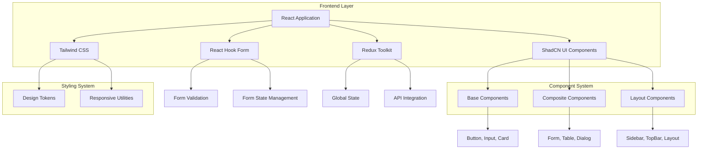
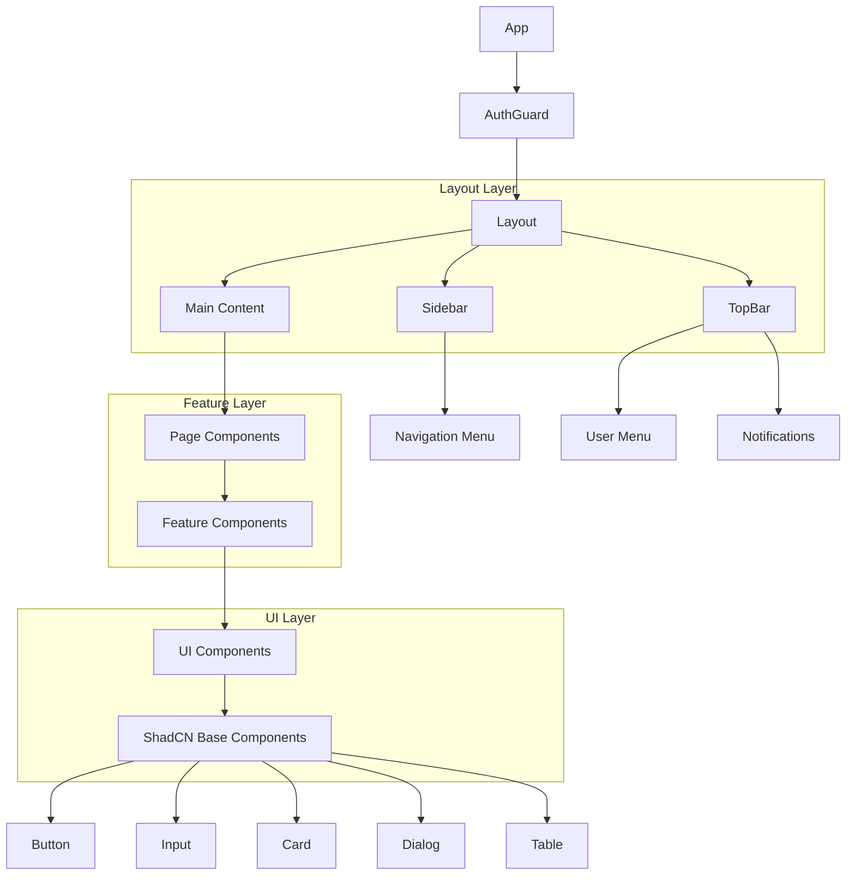

# Arquitetura Técnica - Migração ShadCN UI

## 1. Arquitetura de Design



## 2. Descrição das Tecnologias

- **Frontend:** React@18 + TypeScript + Vite
- **UI Framework:** ShadCN UI + Tailwind CSS@3
- **Formulários:** React Hook Form@7 + Yup@1
- **Estado:** Redux Toolkit@1.9
- **Roteamento:** React Router DOM@6
- **Gráficos:** Recharts@3
- **Internacionalização:** i18next@23
- **Ícones:** Lucide React
- **Utilitários:** clsx, tailwind-merge

## 3. Definições de Rotas

| Rota | Propósito |
|------|----------|
| `/login` | Página de autenticação do usuário |
| `/` | Redirecionamento para dashboard |
| `/dashboard` | Página principal com métricas e gráficos |
| `/lancamentos` | Gestão de lançamentos financeiros |
| `/categorias` | Gestão de categorias de receitas/despesas |
| `/empresas` | Gestão de empresas |
| `/bancos` | Gestão de bancos e instituições financeiras |
| `/contas` | Gestão de contas bancárias |
| `/clientes` | Gestão de clientes |
| `/contas-pagar` | Gestão de contas a pagar |
| `/contas-receber` | Gestão de contas a receber |

## 4. Arquitetura de Componentes

### 4.1 Hierarquia de Componentes



### 4.2 Sistema de Componentes ShadCN

#### Componentes Base
```typescript
// Componentes fundamentais
Button, Input, Label, Textarea
Card, CardHeader, CardContent, CardFooter
Dialog, DialogTrigger, DialogContent
Select, SelectTrigger, SelectContent, SelectItem
Checkbox, RadioGroup, Switch
Badge, Alert, Separator
```

#### Componentes Compostos
```typescript
// Componentes complexos
Form, FormField, FormItem, FormLabel, FormControl
Table, TableHeader, TableBody, TableRow, TableCell
Sheet, SheetTrigger, SheetContent
DropdownMenu, DropdownMenuTrigger, DropdownMenuContent
NavigationMenu, NavigationMenuItem
Breadcrumb, BreadcrumbItem
```

#### Componentes de Layout
```typescript
// Estrutura da aplicação
Sidebar, SidebarContent, SidebarHeader, SidebarFooter
TopBar, TopBarContent, TopBarActions
Layout, LayoutContent, LayoutSidebar
```

## 5. Sistema de Temas e Estilos

### 5.1 Configuração do Tailwind CSS

```javascript
// tailwind.config.js
module.exports = {
  darkMode: ["class"],
  content: [
    './pages/**/*.{ts,tsx}',
    './components/**/*.{ts,tsx}',
    './app/**/*.{ts,tsx}',
    './src/**/*.{ts,tsx}',
  ],
  theme: {
    container: {
      center: true,
      padding: "2rem",
      screens: {
        "2xl": "1400px",
      },
    },
    extend: {
      colors: {
        border: "hsl(var(--border))",
        input: "hsl(var(--input))",
        ring: "hsl(var(--ring))",
        background: "hsl(var(--background))",
        foreground: "hsl(var(--foreground))",
        primary: {
          DEFAULT: "hsl(var(--primary))",
          foreground: "hsl(var(--primary-foreground))",
        },
        secondary: {
          DEFAULT: "hsl(var(--secondary))",
          foreground: "hsl(var(--secondary-foreground))",
        },
        destructive: {
          DEFAULT: "hsl(var(--destructive))",
          foreground: "hsl(var(--destructive-foreground))",
        },
        muted: {
          DEFAULT: "hsl(var(--muted))",
          foreground: "hsl(var(--muted-foreground))",
        },
        accent: {
          DEFAULT: "hsl(var(--accent))",
          foreground: "hsl(var(--accent-foreground))",
        },
        popover: {
          DEFAULT: "hsl(var(--popover))",
          foreground: "hsl(var(--popover-foreground))",
        },
        card: {
          DEFAULT: "hsl(var(--card))",
          foreground: "hsl(var(--card-foreground))",
        },
      },
      borderRadius: {
        lg: "var(--radius)",
        md: "calc(var(--radius) - 2px)",
        sm: "calc(var(--radius) - 4px)",
      },
      keyframes: {
        "accordion-down": {
          from: { height: 0 },
          to: { height: "var(--radix-accordion-content-height)" },
        },
        "accordion-up": {
          from: { height: "var(--radix-accordion-content-height)" },
          to: { height: 0 },
        },
      },
      animation: {
        "accordion-down": "accordion-down 0.2s ease-out",
        "accordion-up": "accordion-up 0.2s ease-out",
      },
    },
  },
  plugins: [require("tailwindcss-animate")],
}
```

### 5.2 Design Tokens

```css
/* globals.css */
@tailwind base;
@tailwind components;
@tailwind utilities;

@layer base {
  :root {
    --background: 0 0% 100%;
    --foreground: 222.2 84% 4.9%;
    --card: 0 0% 100%;
    --card-foreground: 222.2 84% 4.9%;
    --popover: 0 0% 100%;
    --popover-foreground: 222.2 84% 4.9%;
    --primary: 221.2 83.2% 53.3%;
    --primary-foreground: 210 40% 98%;
    --secondary: 210 40% 96%;
    --secondary-foreground: 222.2 84% 4.9%;
    --muted: 210 40% 96%;
    --muted-foreground: 215.4 16.3% 46.9%;
    --accent: 210 40% 96%;
    --accent-foreground: 222.2 84% 4.9%;
    --destructive: 0 84.2% 60.2%;
    --destructive-foreground: 210 40% 98%;
    --border: 214.3 31.8% 91.4%;
    --input: 214.3 31.8% 91.4%;
    --ring: 221.2 83.2% 53.3%;
    --radius: 0.5rem;
    --success: 142.1 76.2% 36.3%;
    --warning: 47.9 95.8% 53.1%;
  }

  .dark {
    --background: 222.2 84% 4.9%;
    --foreground: 210 40% 98%;
    --card: 222.2 84% 4.9%;
    --card-foreground: 210 40% 98%;
    --popover: 222.2 84% 4.9%;
    --popover-foreground: 210 40% 98%;
    --primary: 217.2 91.2% 59.8%;
    --primary-foreground: 222.2 84% 4.9%;
    --secondary: 217.2 32.6% 17.5%;
    --secondary-foreground: 210 40% 98%;
    --muted: 217.2 32.6% 17.5%;
    --muted-foreground: 215 20.2% 65.1%;
    --accent: 217.2 32.6% 17.5%;
    --accent-foreground: 210 40% 98%;
    --destructive: 0 62.8% 30.6%;
    --destructive-foreground: 210 40% 98%;
    --border: 217.2 32.6% 17.5%;
    --input: 217.2 32.6% 17.5%;
    --ring: 224.3 76.3% 94.1%;
  }
}
```

## 6. Integração com React Hook Form

### 6.1 Wrapper de Formulário

```typescript
// components/ui/form.tsx
import { createContext, useContext } from "react"
import { FieldPath, FieldValues, UseFormReturn } from "react-hook-form"

type FormFieldContextValue<
  TFieldValues extends FieldValues = FieldValues,
  TName extends FieldPath<TFieldValues> = FieldPath<TFieldValues>
> = {
  name: TName
}

type FormItemContextValue = {
  id: string
}

const FormFieldContext = createContext<FormFieldContextValue>({} as FormFieldContextValue)
const FormItemContext = createContext<FormItemContextValue>({} as FormItemContextValue)

const Form = <TFieldValues extends FieldValues>(
  props: React.ComponentProps<"form"> & {
    form: UseFormReturn<TFieldValues>
  }
) => {
  return <form {...props} />
}

const FormField = <
  TFieldValues extends FieldValues = FieldValues,
  TName extends FieldPath<TFieldValues> = FieldPath<TFieldValues>
>({
  ...props
}: ControllerProps<TFieldValues, TName>) => {
  return (
    <FormFieldContext.Provider value={{ name: props.name }}>
      <Controller {...props} />
    </FormFieldContext.Provider>
  )
}
```

### 6.2 Exemplo de Uso

```typescript
// Exemplo de formulário migrado
const CategoriaForm = () => {
  const form = useForm<CategoriaFormData>({
    resolver: yupResolver(categoriaSchema),
    defaultValues: {
      NomCategoria: '',
      TipoCategoria: 'R',
      FlgAtivo: 'S',
    },
  })

  return (
    <Dialog open={open} onOpenChange={onClose}>
      <DialogContent className="sm:max-w-[425px]">
        <DialogHeader>
          <DialogTitle>{isEditing ? 'Editar Categoria' : 'Nova Categoria'}</DialogTitle>
        </DialogHeader>
        
        <Form form={form} onSubmit={form.handleSubmit(onSubmit)} className="space-y-4">
          <FormField
            control={form.control}
            name="NomCategoria"
            render={({ field }) => (
              <FormItem>
                <FormLabel>Nome da Categoria</FormLabel>
                <FormControl>
                  <Input placeholder="Digite o nome..." {...field} />
                </FormControl>
                <FormMessage />
              </FormItem>
            )}
          />
          
          <FormField
            control={form.control}
            name="TipoCategoria"
            render={({ field }) => (
              <FormItem>
                <FormLabel>Tipo</FormLabel>
                <Select onValueChange={field.onChange} defaultValue={field.value}>
                  <FormControl>
                    <SelectTrigger>
                      <SelectValue placeholder="Selecione o tipo" />
                    </SelectTrigger>
                  </FormControl>
                  <SelectContent>
                    <SelectItem value="R">Receita</SelectItem>
                    <SelectItem value="D">Despesa</SelectItem>
                    <SelectItem value="T">Transferência</SelectItem>
                  </SelectContent>
                </Select>
                <FormMessage />
              </FormItem>
            )}
          />
          
          <DialogFooter>
            <Button type="button" variant="outline" onClick={onClose}>
              Cancelar
            </Button>
            <Button type="submit" disabled={loading}>
              {loading && <Loader2 className="mr-2 h-4 w-4 animate-spin" />}
              {isEditing ? 'Atualizar' : 'Criar'}
            </Button>
          </DialogFooter>
        </Form>
      </DialogContent>
    </Dialog>
  )
}
```

## 7. Sistema de Tabelas

### 7.1 Componente de Tabela Avançada

```typescript
// components/ui/data-table.tsx
interface DataTableProps<TData, TValue> {
  columns: ColumnDef<TData, TValue>[]
  data: TData[]
  searchKey?: string
  pagination?: boolean
  sorting?: boolean
  filtering?: boolean
}

export function DataTable<TData, TValue>({
  columns,
  data,
  searchKey,
  pagination = true,
  sorting = true,
  filtering = true,
}: DataTableProps<TData, TValue>) {
  const [sorting, setSorting] = React.useState<SortingState>([])
  const [columnFilters, setColumnFilters] = React.useState<ColumnFiltersState>([])
  const [columnVisibility, setColumnVisibility] = React.useState<VisibilityState>({})
  const [rowSelection, setRowSelection] = React.useState({})

  const table = useReactTable({
    data,
    columns,
    onSortingChange: setSorting,
    onColumnFiltersChange: setColumnFilters,
    getCoreRowModel: getCoreRowModel(),
    getPaginationRowModel: getPaginationRowModel(),
    getSortedRowModel: getSortedRowModel(),
    getFilteredRowModel: getFilteredRowModel(),
    onColumnVisibilityChange: setColumnVisibility,
    onRowSelectionChange: setRowSelection,
    state: {
      sorting,
      columnFilters,
      columnVisibility,
      rowSelection,
    },
  })

  return (
    <div className="w-full">
      {filtering && searchKey && (
        <div className="flex items-center py-4">
          <Input
            placeholder={`Filtrar por ${searchKey}...`}
            value={(table.getColumn(searchKey)?.getFilterValue() as string) ?? ""}
            onChange={(event) =>
              table.getColumn(searchKey)?.setFilterValue(event.target.value)
            }
            className="max-w-sm"
          />
        </div>
      )}
      
      <div className="rounded-md border">
        <Table>
          <TableHeader>
            {table.getHeaderGroups().map((headerGroup) => (
              <TableRow key={headerGroup.id}>
                {headerGroup.headers.map((header) => (
                  <TableHead key={header.id}>
                    {header.isPlaceholder
                      ? null
                      : flexRender(
                          header.column.columnDef.header,
                          header.getContext()
                        )}
                  </TableHead>
                ))}
              </TableRow>
            ))}
          </TableHeader>
          <TableBody>
            {table.getRowModel().rows?.length ? (
              table.getRowModel().rows.map((row) => (
                <TableRow
                  key={row.id}
                  data-state={row.getIsSelected() && "selected"}
                >
                  {row.getVisibleCells().map((cell) => (
                    <TableCell key={cell.id}>
                      {flexRender(
                        cell.column.columnDef.cell,
                        cell.getContext()
                      )}
                    </TableCell>
                  ))}
                </TableRow>
              ))
            ) : (
              <TableRow>
                <TableCell
                  colSpan={columns.length}
                  className="h-24 text-center"
                >
                  Nenhum resultado encontrado.
                </TableCell>
              </TableRow>
            )}
          </TableBody>
        </Table>
      </div>
      
      {pagination && (
        <div className="flex items-center justify-end space-x-2 py-4">
          <div className="flex-1 text-sm text-muted-foreground">
            {table.getFilteredSelectedRowModel().rows.length} de{" "}
            {table.getFilteredRowModel().rows.length} linha(s) selecionada(s).
          </div>
          <div className="space-x-2">
            <Button
              variant="outline"
              size="sm"
              onClick={() => table.previousPage()}
              disabled={!table.getCanPreviousPage()}
            >
              Anterior
            </Button>
            <Button
              variant="outline"
              size="sm"
              onClick={() => table.nextPage()}
              disabled={!table.getCanNextPage()}
            >
              Próximo
            </Button>
          </div>
        </div>
      )}
    </div>
  )
}
```

## 8. Padrões de Migração

### 8.1 Mapeamento MUI → ShadCN

| Componente MUI | Componente ShadCN | Observações |
|----------------|-------------------|-------------|
| `Button` | `Button` | Variantes diferentes |
| `TextField` | `Input` | Wrapper necessário para labels |
| `Select` | `Select` | API diferente |
| `Dialog` | `Dialog` | Estrutura similar |
| `Card` | `Card` | Estrutura similar |
| `Paper` | `Card` | Conceito equivalente |
| `Box` | `div` + classes | Usar Tailwind |
| `Grid` | `div` + grid classes | CSS Grid/Flexbox |
| `Typography` | Tailwind classes | `text-*` classes |
| `IconButton` | `Button` variant="ghost" | Com ícone |

### 8.2 Exemplo de Migração

**Antes (MUI):**
```typescript
<Box sx={{ p: 2 }}>
  <Typography variant="h4" gutterBottom>
    Título
  </Typography>
  <TextField
    fullWidth
    label="Nome"
    variant="outlined"
    size="small"
  />
  <Button variant="contained" color="primary">
    Salvar
  </Button>
</Box>
```

**Depois (ShadCN):**
```typescript
<div className="p-4">
  <h2 className="text-2xl font-semibold mb-4">
    Título
  </h2>
  <div className="space-y-2">
    <Label htmlFor="nome">Nome</Label>
    <Input id="nome" placeholder="Digite o nome..." />
  </div>
  <Button className="mt-4">
    Salvar
  </Button>
</div>
```

## 9. Performance e Otimizações

### 9.1 Code Splitting
```typescript
// Lazy loading de páginas
const DashboardPage = lazy(() => import('./features/dashboard/pages/DashboardPage'))
const LancamentosPage = lazy(() => import('./features/lancamentos/pages/LancamentosPage'))

// Suspense wrapper
<Suspense fallback={<div className="flex items-center justify-center h-screen"><Loader2 className="h-8 w-8 animate-spin" /></div>}>
  <Routes>
    <Route path="/dashboard" element={<DashboardPage />} />
    <Route path="/lancamentos" element={<LancamentosPage />} />
  </Routes>
</Suspense>
```

### 9.2 Memoização
```typescript
// Componentes memoizados
const StatCard = memo(({ title, value, icon, color }: StatCardProps) => {
  return (
    <Card>
      <CardContent className="p-6">
        <div className="flex items-center justify-between">
          <div>
            <p className="text-sm font-medium text-muted-foreground">{title}</p>
            <p className="text-2xl font-bold">{value}</p>
          </div>
          <div className={cn("p-2 rounded-lg", color)}>
            {icon}
          </div>
        </div>
      </CardContent>
    </Card>
  )
})
```

## 10. Acessibilidade

### 10.1 Padrões ARIA
```typescript
// Exemplo de componente acessível
const AccessibleButton = ({ children, ...props }) => {
  return (
    <Button
      {...props}
      aria-label={props['aria-label'] || children}
      role="button"
      tabIndex={0}
    >
      {children}
    </Button>
  )
}
```

### 10.2 Navegação por Teclado
```typescript
// Hook para navegação por teclado
const useKeyboardNavigation = () => {
  useEffect(() => {
    const handleKeyDown = (event: KeyboardEvent) => {
      if (event.key === 'Escape') {
        // Fechar modais/dropdowns
      }
      if (event.key === 'Tab') {
        // Gerenciar foco
      }
    }
    
    document.addEventListener('keydown', handleKeyDown)
    return () => document.removeEventListener('keydown', handleKeyDown)
  }, [])
}
```

---

**Versão:** 1.0
**Data:** Janeiro 2025
**Status:** 🟡 Em Desenvolvimento