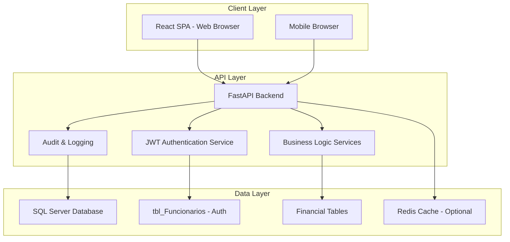
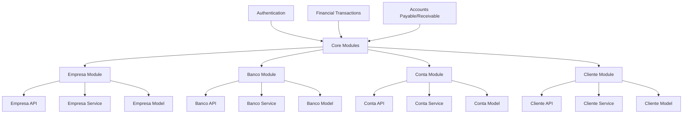
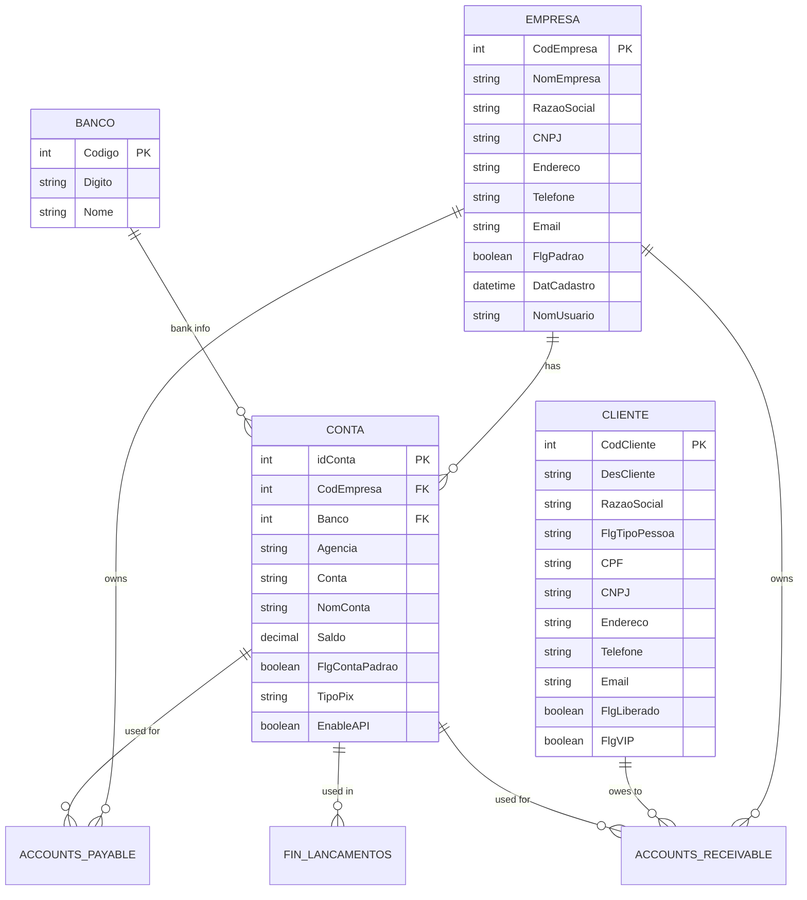
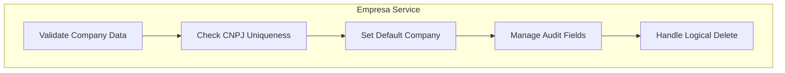
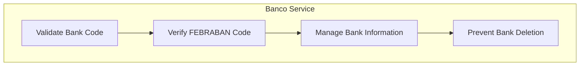
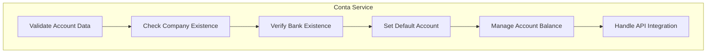
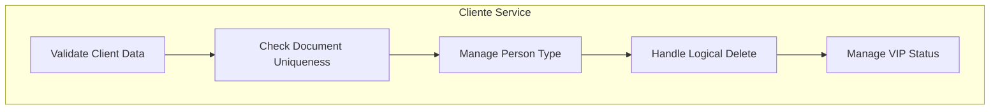
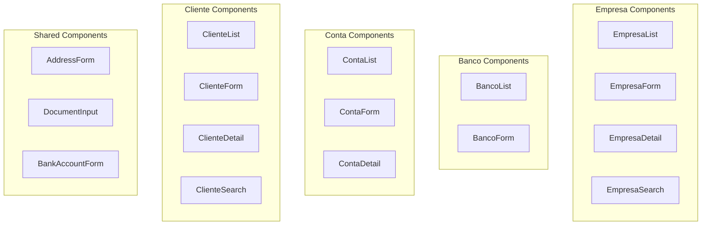
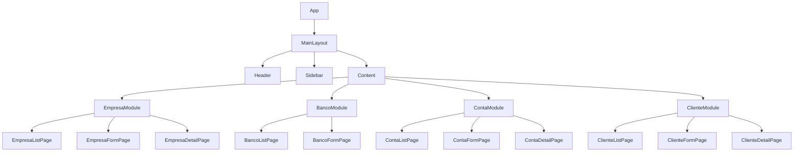

# Financial Web Application Development Continuation Plan

## Overview

This document outlines the continuation plan for developing the financial web application for the "Locador" system. Based on the existing documentation, we'll focus on implementing the additional features and modules that extend the core functionality already designed.

The project will implement a comprehensive financial management system with modules for companies, banks, accounts, clients, and enhanced financial operations, while maintaining integration with the existing `tbl_Funcionarios` authentication system.

## Technology Stack & Dependencies

### Backend Stack
- **Framework**: Python 3.10+ with FastAPI
- **ORM**: SQLAlchemy for database interactions
- **Database**: SQL Server (existing database integration)
- **Authentication**: JWT with SHA-256 password hashing (compatible with existing system)
- **Validation**: Pydantic for data validation and serialization
- **Migrations**: Alembic for database schema management
- **API Documentation**: Swagger/OpenAPI (automatic with FastAPI)

### Frontend Stack
- **Framework**: React 18+ with TypeScript
- **UI Library**: Material-UI (MUI) for component library
- **State Management**: Redux Toolkit for global state
- **Server State**: React Query for server state management
- **HTTP Client**: Axios for API communication
- **Forms**: React Hook Form with Yup validation
- **Routing**: React Router v6
- **Charts**: Chart.js or Recharts for data visualization
- **Localization**: Complete pt-BR localization with react-i18next

### DevOps & Infrastructure
- **Containerization**: Docker and Docker Compose
- **Testing**: pytest (backend), Jest/React Testing Library (frontend)

## Architecture

### System Architecture Overview



### New Modules Architecture



## Data Models & ORM Mapping

### New Entity Models

#### Empresa (Company)
```python
class Empresa(Base):
    __tablename__ = 'tbl_Empresa'
    
    CodEmpresa = Column(Integer, primary_key=True, index=True)
    NomEmpresa = Column(String(100), nullable=False)
    RazaoSocial = Column(String(150), nullable=False)
    CNPJ = Column(String(18), unique=True, nullable=False)
    Endereco = Column(String(200))
    Bairro = Column(String(100))
    CEP = Column(String(9))
    Municipio = Column(String(100))
    Estado = Column(String(2))
    Telefone = Column(String(20))
    Email = Column(String(100))
    FlgPadrao = Column(Boolean, default=False)
    DatCadastro = Column(DateTime, default=datetime.utcnow)
    NomUsuario = Column(String(50), nullable=False)
    DatAlteracao = Column(DateTime)
    NomUsuarioAlteracao = Column(String(50))
```

#### Banco (Bank)
```python
class Banco(Base):
    __tablename__ = 'tbl_Banco'
    
    Codigo = Column(Integer, primary_key=True)
    Digito = Column(String(2))
    Nome = Column(String(100), nullable=False)
```

#### Conta (Bank Account)
```python
class Conta(Base):
    __tablename__ = 'tbl_Conta'
    
    idConta = Column(Integer, primary_key=True)
    CodEmpresa = Column(Integer, ForeignKey('tbl_Empresa.CodEmpresa'), nullable=False)
    Banco = Column(Integer, ForeignKey('tbl_Banco.Codigo'), nullable=False)
    Agencia = Column(String(10), nullable=False)
    AgenciaDigito = Column(String(2))
    Conta = Column(String(20), nullable=False)
    ContaDigito = Column(String(2))
    NomConta = Column(String(100), nullable=False)
    Saldo = Column(DECIMAL(18, 2), default=0)
    FlgContaPadrao = Column(Boolean, default=False)
    TipoPix = Column(String(20))
    ValorPix = Column(String(100))
    EnableAPI = Column(Boolean, default=False)
    ConfiguracaoAPI = Column(String(500))
    DatCadastro = Column(DateTime, default=datetime.utcnow)
    NomUsuario = Column(String(50), nullable=False)
    DatAlteracao = Column(DateTime)
    NomUsuarioAlteracao = Column(String(50))
    
    # Relationships
    empresa = relationship("Empresa", back_populates="contas")
    banco = relationship("Banco")
```

#### Cliente (Client)
```python
class Cliente(Base):
    __tablename__ = 'tbl_Clientes'
    
    CodCliente = Column(Integer, primary_key=True)
    DesCliente = Column(String(100), nullable=False)
    RazaoSocial = Column(String(150))
    FlgTipoPessoa = Column(String(1), nullable=False)  # F: Física, J: Jurídica
    CPF = Column(String(14))  # For individuals
    RG = Column(String(20))   # For individuals
    CNPJ = Column(String(18)) # For companies
    IE = Column(String(20))   # For companies
    IM = Column(String(20))   # For companies
    Endereco = Column(String(200))
    Bairro = Column(String(100))
    CEP = Column(String(9))
    Municipio = Column(String(100))
    Estado = Column(String(2))
    Telefone = Column(String(20))
    Email = Column(String(100))
    FlgLiberado = Column(Boolean, default=True)
    FlgVIP = Column(Boolean, default=False)
    DatCadastro = Column(DateTime, default=datetime.utcnow)
    NomUsuario = Column(String(50), nullable=False)
    DatAlteracao = Column(DateTime)
    NomUsuarioAlteracao = Column(String(50))
```

### Entity Relationship Mapping



## API Endpoints Reference

### Empresa Endpoints
```
GET    /api/v1/empresas/                    # List all companies
GET    /api/v1/empresas/{id}                # Get company by ID
POST   /api/v1/empresas/                    # Create new company
PUT    /api/v1/empresas/{id}                # Update company
DELETE /api/v1/empresas/{id}                # Delete company (logical)
```

### Banco Endpoints
```
GET    /api/v1/bancos/                      # List all banks
GET    /api/v1/bancos/{id}                  # Get bank by ID
POST   /api/v1/bancos/                      # Create new bank
PUT    /api/v1/bancos/{id}                  # Update bank
DELETE /api/v1/bancos/{id}                  # Delete bank
```

### Conta Endpoints
```
GET    /api/v1/contas/                      # List all accounts
GET    /api/v1/contas/{id}                  # Get account by ID
POST   /api/v1/contas/                      # Create new account
PUT    /api/v1/contas/{id}                  # Update account
DELETE /api/v1/contas/{id}                  # Delete account
GET    /api/v1/contas/empresa/{empresa_id}  # Get accounts by company
```

### Cliente Endpoints
```
GET    /api/v1/clientes/                    # List all clients
GET    /api/v1/clientes/{id}                # Get client by ID
POST   /api/v1/clientes/                    # Create new client
PUT    /api/v1/clientes/{id}                # Update client
DELETE /api/v1/clientes/{id}                # Delete client (logical)
GET    /api/v1/clientes/search              # Search clients
```

### Authentication Requirements
All endpoints require:
- Bearer JWT token in Authorization header
- Valid user session (user must be active in tbl_Funcionarios)
- Token contains user identification for audit trail

## Business Logic Layer

### Empresa Service Architecture



### Banco Service Architecture



### Conta Service Architecture



### Cliente Service Architecture



## Middleware & Interceptors

### Backend Middleware
1. **Validation Middleware**
   - Data validation for new entities
   - Business rule validation
   - Cross-field validation

2. **Audit Middleware**
   - Automatic population of audit fields
   - Request/response logging with user context
   - Performance monitoring

3. **Security Middleware**
   - Rate limiting for API endpoints
   - Input sanitization
   - Request validation

## Frontend Component Architecture

### New Component Structure



### Component Hierarchy



## State Management

### Redux Store Structure
```typescript
interface RootState {
  auth: AuthState;
  empresa: EmpresaState;
  banco: BancoState;
  conta: ContaState;
  cliente: ClienteState;
  ui: UIState;
}

interface EmpresaState {
  empresas: Empresa[];
  currentEmpresa: Empresa | null;
  loading: boolean;
  error: string | null;
}

interface BancoState {
  bancos: Banco[];
  loading: boolean;
  error: string | null;
}

interface ContaState {
  contas: Conta[];
  empresaContas: Record<number, Conta[]>;
  loading: boolean;
  error: string | null;
}

interface ClienteState {
  clientes: Cliente[];
  currentCliente: Cliente | null;
  loading: boolean;
  error: string | null;
}
```

## API Integration Layer

### Service Layer Implementation
```typescript
class EmpresaService {
  async getEmpresas(): Promise<Empresa[]> {
    const response = await apiClient.get('/empresas');
    return response.data;
  }
  
  async createEmpresa(data: EmpresaCreate): Promise<Empresa> {
    const response = await apiClient.post('/empresas', data);
    return response.data;
  }
  
  async updateEmpresa(id: number, data: EmpresaUpdate): Promise<Empresa> {
    const response = await apiClient.put(`/empresas/${id}`, data);
    return response.data;
  }
  
  async deleteEmpresa(id: number): Promise<void> {
    await apiClient.delete(`/empresas/${id}`);
  }
}

class BancoService {
  async getBancos(): Promise<Banco[]> {
    const response = await apiClient.get('/bancos');
    return response.data;
  }
  
  // Similar methods for create, update, delete
}

class ContaService {
  async getContas(): Promise<Conta[]> {
    const response = await apiClient.get('/contas');
    return response.data;
  }
  
  async getContasByEmpresa(empresaId: number): Promise<Conta[]> {
    const response = await apiClient.get(`/contas/empresa/${empresaId}`);
    return response.data;
  }
  
  // Similar methods for create, update, delete
}

class ClienteService {
  async getClientes(params?: ClienteSearch): Promise<Cliente[]> {
    const response = await apiClient.get('/clientes', { params });
    return response.data;
  }
  
  // Similar methods for create, update, delete
}
```

## Testing Strategy

### Backend Testing

#### Unit Tests (pytest)
```python
class TestEmpresaService:
    def test_create_empresa_success(self):
        # Test successful company creation
        pass
    
    def test_create_empresa_duplicate_cnpj(self):
        # Test duplicate CNPJ validation
        pass
    
    def test_update_empresa_audit_fields(self):
        # Test audit field population
        pass

class TestBancoService:
    def test_create_banco_valid_febraban(self):
        # Test valid FEBRABAN code
        pass
    
    def test_prevent_banco_deletion_with_accounts(self):
        # Test deletion prevention
        pass

class TestContaService:
    def test_create_conta_with_valid_references(self):
        # Test account creation with valid company and bank
        pass
    
    def test_set_default_account_per_company(self):
        # Test default account logic
        pass

class TestClienteService:
    def test_create_cliente_document_validation(self):
        # Test document validation for PF/PJ
        pass
    
    def test_search_cliente_by_name(self):
        # Test client search functionality
        pass
```

### Frontend Testing

#### Component Tests (Jest + React Testing Library)
```typescript
describe('EmpresaForm', () => {
  test('should render form fields correctly', () => {
    // Test component rendering
  });
  
  test('should validate required fields', () => {
    // Test form validation
  });
  
  test('should submit form with valid data', () => {
    // Test form submission
  });
});

describe('ClienteSearch', () => {
  test('should filter clients by name', () => {
    // Test client search functionality
  });
  
  test('should display search results', () => {
    // Test search results display
  });
});
```

## Development Roadmap

### Phase 1: Empresa and Banco Modules (2 weeks)
- Implement Empresa and Banco models, services, and APIs
- Create basic CRUD operations
- Implement validation and business rules
- Develop unit tests

### Phase 2: Conta Module (1.5 weeks)
- Implement Conta model, service, and API
- Create relationships with Empresa and Banco
- Implement account balance management
- Develop unit tests

### Phase 3: Cliente Module (1.5 weeks)
- Implement Cliente model, service, and API
- Create document validation for PF/PJ
- Implement search functionality
- Develop unit tests

### Phase 4: Frontend Implementation (3 weeks)
- Develop components for all new modules
- Implement state management
- Create forms with validation
- Integrate with backend APIs

### Phase 5: Integration and Testing (2 weeks)
- End-to-end testing
- Performance optimization
- Security review
- Documentation completion

## Deployment Considerations

### Environment Configuration
- Docker containerization for all services
- Environment-specific configuration files
- Database migration scripts
- Health check endpoints

### Security Measures
- Input validation and sanitization
- Rate limiting for API endpoints
- Secure storage of sensitive configuration
- Regular security audits

### Monitoring and Logging
- Application performance monitoring
- Error tracking and alerting
- Audit logging for financial operations
- User activity tracking