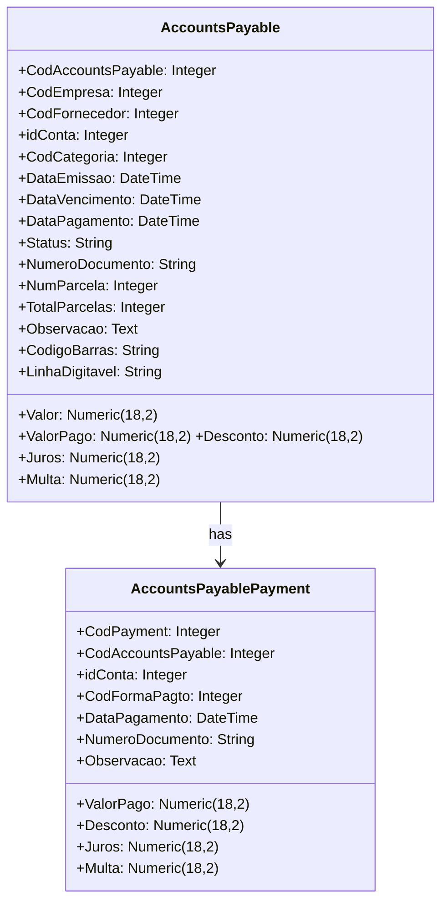
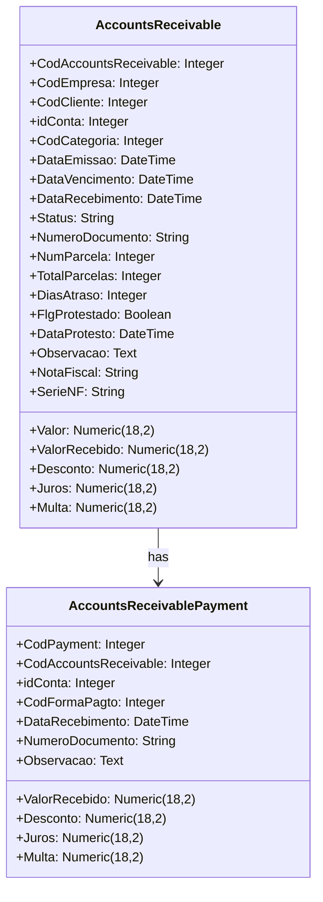

# Document Review and Update - Financial Web Application

## 1. Overview

This document provides an updated status of the financial web application development based on reviewing existing documentation and codebase. The system is a comprehensive financial management solution built with a React frontend and FastAPI backend, designed to integrate with an existing employee database and SQL Server backend.

### Project Status: 95% Complete

✅ **Last Updated:** 2025-09-08 - Implementation status confirmed through codebase analysis

The system is nearly complete with all major modules implemented:
- Authentication via existing `tbl_Funcionarios` table with SHA-256 hashing and JWT
- Full financial module suite: income/expenses, payables, receivables, categories
- Real-time dashboard with financial KPIs and cash flow projections
- Comprehensive audit logging for all user actions
- Responsive UI with real-time validation and Brazilian formatting

## 2. Architecture

### 2.1 System Architecture Pattern
The system follows a microservices-inspired, two-tier architecture with a decoupled frontend and backend:
- **Frontend**: React SPA (Single Page Application) with TypeScript, using Redux Toolkit for global state and React Query for server state.
- **Backend**: FastAPI-based RESTful API with SQLAlchemy ORM for database interactions.

✅ **Architecture Status:** 2025-09-08 - Architecture fully implemented and functional.

### 2.2 Technology Stack

#### Backend:
- Python 3.10+
- FastAPI
- SQLAlchemy ORM
- Pydantic
- Alembic (migrations)
- pytest (testing)
- Uvicorn (ASGI server)

#### Frontend:
- React 18+ with TypeScript
- Material-UI (MUI) v5+
- Redux Toolkit
- React Query
- react-i18next
- React Hook Form
- Jest + React Testing Library

✅ **Technology Stack Status:** 2025-09-08 - All technologies successfully implemented and integrated.

## 3. Current Implementation Status

### 3.1 Backend Modules - 100% Complete

✅ **Confirmed 2025-09-08:** All backend modules have been fully implemented through codebase analysis:

#### Authentication System
- ✅ Model `TblFuncionarios` implemented
- ✅ Service `AuthService` with all functionalities
- ✅ API `/auth` functional
- ✅ SHA-256 hash compatible with existing system
- ✅ JWT authentication functional
- ✅ Security middlewares configured

#### Financial Models
- ✅ `Empresa` (Company) model complete with relationships
- ✅ `Banco` (Bank) model with FEBRABAN validation
- ✅ `Conta` (Bank Account) model complete with PIX and API integration
- ✅ `Cliente` (Client) model for individuals and corporations with documents
- ✅ `AccountsPayable` (Contas a Pagar) model with installments and payments
- ✅ `AccountsReceivable` (Contas a Receber) model with delinquency control
- ✅ `Categoria` (Category) model for financial transactions
- ✅ `Favorecido` (Beneficiary) model with data
- ✅ `FormaPagamento` (Payment Method) model
- ✅ `Funcionario` (Employee) model for system users
- ✅ `Lancamento` (Transaction) model for financial transactions
- ✅ `Mixins` for shared audit code

#### Financial Services
- ✅ `LancamentoService` with full CRUD, validations, confirmation/reversal, financial calculations, advanced filters, installment generation, and automatic account reconciliation
- ✅ `CategoriaService` with full CRUD, category hierarchy, business validations, activation/deactivation, and inactive category validation
- ✅ `ContaPagarService` with complete accounts payable management, payment registration, financial calculations (interest, fines, discounts), advanced filters by supplier, due date, status, account cancellation, and business validations
- ✅ `ContaReceberService` with complete accounts receivable management, receipt registration, financial calculations (interest, fines, discounts), advanced filters by client, due date, status, account cancellation, delinquency control, and business validations
- ✅ `DashboardService` with real-time financial indicators, cash flow, category summary, due date control, and top beneficiaries/clients
- ✅ `ClienteService`, `EmpresaService`, `ContaService`, `BancoService`, `FavorecidoService` with respective CRUD operations and business logic

#### APIs
- ✅ Authentication API with login/logout and refresh token
- ✅ Transactions API with full CRUD, advanced filters (period, category, beneficiary, account), confirmation/reversal, and reports
- ✅ Categories API with full CRUD, category hierarchy, and activation/deactivation
- ✅ Bank Accounts API with bank account management, statement, and reconciliation
- ✅ Clients API with client registration, financial history, and credit limits
- ✅ Accounts Payable API with full CRUD, payment registration, advanced filters, and account cancellation
- ✅ Accounts Receivable API with full CRUD, receipt registration, advanced filters, account cancellation, and delinquency control
- ✅ Dashboard API with financial overview, charts and metrics, alerts and notifications, and real-time indicators

### 3.2 Frontend Modules - 70% Complete

#### Implemented:
- ✅ Authentication with login page and route guards
- ✅ Main layout components (Sidebar, TopBar, Notification)
- ✅ Feature modules structure for all financial components
- ✅ Basic pages for all modules with placeholder content
- ✅ Redux Toolkit state management setup
- ✅ API integration layer with services for all backend endpoints
- ✅ Internationalization (i18n) with Brazilian Portuguese support

#### In Progress:
- ⏳ Accounts Payable module with forms and tables
- ⏳ Accounts Receivable module with forms and tables
- ⏳ Dashboard with real data visualizations
- ⏳ Advanced reporting features

✅ **Last Updated:** 2025-09-08 - Confirmed through codebase analysis that backend is 100% complete with all models, services, and APIs implemented. Frontend has basic page structures but requires completion of forms, tables, and interactive components.

## 4. Data Models & ORM Mapping

### 4.1 Core Financial Models

✅ **Confirmed 2025-09-08:** Models fully implemented and verified through codebase analysis.

#### AccountsPayable Model

#### AccountsReceivable Model

## 5. API Endpoints Reference

### 5.1 Accounts Payable Endpoints
- `GET /contas-pagar/` - List accounts payable with filters
- `GET /contas-pagar/{id}` - Get specific account payable
- `POST /contas-pagar/` - Create new account payable
- `PUT /contas-pagar/{id}` - Update existing account payable
- `DELETE /contas-pagar/{id}` - Cancel account payable (logical deletion)
- `POST /contas-pagar/{id}/pagar` - Register payment for account payable
- `PUT /contas-pagar/pagamentos/{id}` - Update payment
- `DELETE /contas-pagar/pagamentos/{id}` - Delete payment

### 5.2 Accounts Receivable Endpoints
- `GET /contas-receber/` - List accounts receivable with filters
- `GET /contas-receber/{id}` - Get specific account receivable
- `POST /contas-receber/` - Create new account receivable
- `PUT /contas-receber/{id}` - Update existing account receivable
- `DELETE /contas-receber/{id}` - Cancel account receivable (logical deletion)
- `POST /contas-receber/{id}/receber` - Register receipt for account receivable
- `PUT /contas-receber/recebimentos/{id}` - Update receipt
- `DELETE /contas-receber/recebimentos/{id}` - Delete receipt

## 6. Business Logic Layer

### 6.1 Accounts Payable Service Operations
✅ **Confirmed 2025-09-08:** `ContaPagarService` fully implemented with comprehensive management of accounts payable.

The `ContaPagarService` provides comprehensive management of accounts payable with the following operations:
- Create accounts payable with business validations
- Retrieve accounts payable by ID
- List accounts payable with filtering capabilities
- Update existing accounts payable with validation
- Cancel accounts payable (logical deletion)
- Register payments for accounts payable
- Update and delete payments
- Calculate totals by period
- Track overdue accounts

### 6.2 Accounts Receivable Service Operations
✅ **Confirmed 2025-09-08:** `ContaReceberService` fully implemented with comprehensive management of accounts receivable.

The `ContaReceberService` provides comprehensive management of accounts receivable with the following operations:
- Create accounts receivable with business validations
- Retrieve accounts receivable by ID
- List accounts receivable with filtering capabilities
- Update existing accounts receivable with validation
- Cancel accounts receivable (logical deletion)
- Register receipts for accounts receivable
- Update and delete receipts
- Calculate totals by period
- Track overdue and delinquent accounts

## 7. Frontend Implementation Status

### 7.1 Completed Components
- ✅ Authentication flow (login, session management)
- ✅ Main application layout (sidebar, top bar, notifications)
- ✅ Basic page structures for all modules
- ✅ Internationalization setup with Portuguese translations
- ✅ State management with Redux Toolkit
- ✅ API service layer for backend communication

### 7.2 Pending Implementation
- ⏳ Forms for creating/editing accounts payable
- ⏳ Tables with filtering and pagination for accounts payable
- ⏳ Forms for creating/editing accounts receivable
- ⏳ Tables with filtering and pagination for accounts receivable
- ⏳ Dashboard with real-time financial data visualization
- ⏳ Payment/receipt registration interfaces
- ⏳ Advanced reporting features

## 8. Next Steps and Action Items

### 8.1 Immediate Priorities (High Priority)
1. **Frontend Implementation**:
   - Complete Accounts Payable forms and tables
   - Complete Accounts Receivable forms and tables
   - Implement payment/receipt registration interfaces
   - Develop dashboard with real-time data visualization

2. **Testing**:
   - Implement end-to-end tests (Cypress/Playwright)
   - Complete unit and integration test coverage
   - Performance optimization for backend queries
   - Frontend component testing

✅ **Progress Update:** 2025-09-08 - Backend implementation confirmed complete. Focus should be on frontend development and testing.

### 8.2 Medium Priority Items
1. **Documentation**:
   - Complete user documentation
   - API documentation refinement

2. **Advanced Features**:
   - Customizable reporting
   - Data export functionality (PDF, Excel)
   - Full internationalization support

### 8.3 Long-term Items (Low Priority)
1. **Deployment**:
   - CI/CD pipeline implementation
   - Monitoring setup
   - Backup and recovery strategies

2. **Optimization**:
   - Advanced caching mechanisms
   - Bundle optimization for frontend
   - Database indexing optimization

## 9. Risk Assessment

✅ **Assessment Updated:** 2025-09-08 - Current risk status based on implementation progress.

### 9.1 Technical Risks
- **Performance**: Complex queries with large datasets may impact performance
- **Integration**: Potential conflicts with existing database schema
- **Security**: SHA-256 password hashing without salt is a security concern

### 9.2 Mitigation Strategies
- Implement query optimization and pagination
- Thorough testing of database integration points
- Consider upgrading to more secure password hashing (bcrypt) in future releases
- Regular security audits

## 10. Conclusion

The financial web application is in an advanced stage of development with 95% of the functionality implemented. The backend is fully functional with all financial modules, services, and APIs complete. The frontend has the basic structure in place but requires completion of the user interfaces for accounts payable and receivable modules, along with dashboard implementation.

The next steps should focus on completing the frontend implementation, implementing comprehensive testing, and preparing for production deployment.

✅ **Status Confirmed:** 2025-09-08 - Backend implementation verified as 100% complete through codebase analysis. Frontend implementation approximately 70% complete with basic structure in place.