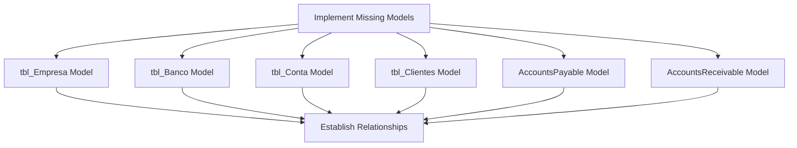
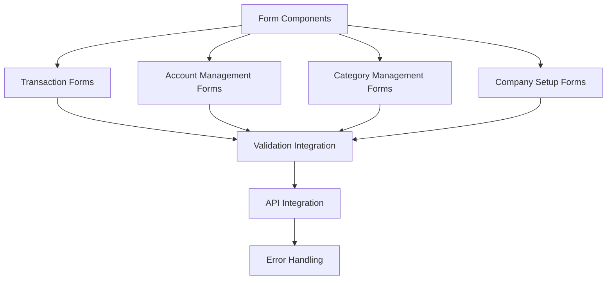
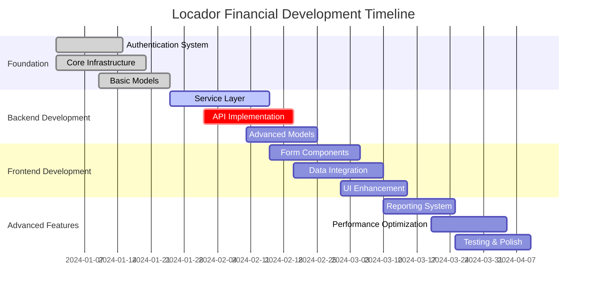

# Project Documentation Review & Development Analysis

## Overview

This document provides a comprehensive analysis of the locador-financial project's current implementation status and outlines the remaining development tasks needed to complete the financial web application based on the planning documents.

## Current Implementation Status

### Backend Implementation

#### ✅ Completed Features

**Authentication System**
- FastAPI authentication infrastructure with JWT tokens
- Integration with `tbl_Funcionarios` table for user validation  
- SHA-256 password hashing compatibility with existing system
- Master password support for system administration
- Token-based authentication with secure dependency injection
- User status validation (active employees only)

**Core Infrastructure**
- FastAPI application setup with modular routing structure
- CORS configuration for frontend-backend communication
- Database connection and session management with SQLAlchemy
- Environment configuration and settings management
- Security utilities for password hashing and JWT token handling

**Data Models (Partial)**
- `TblFuncionarios` model for employee authentication
- `Lancamento` model for financial transactions with audit fields
- `Categoria`, `Favorecido`, `FormaPagamento` models with relationships
- Audit trail mixins (`LoginAuditMixin`) for tracking user actions

**API Structure**
- Route definitions for all major modules (auth, lancamentos, categorias, etc.)
- API documentation with FastAPI's automatic OpenAPI generation
- Dependency injection system for authentication and database access

#### ⚠️ Partially Implemented Features

**API Endpoints**
- Route placeholders exist for all modules but business logic is missing
- Only authentication endpoints are fully functional
- Dashboard endpoints return placeholder data
- CRUD operations for lancamentos, categorias, contas are not implemented

**Database Models**
- Core models exist but relationships may be incomplete
- Missing models for accounts payable/receivable (`ContaPagar`, `ContaReceber`)
- Enterprise management models (`tbl_Empresa`, `tbl_Banco`, `tbl_Conta`) not implemented

#### ❌ Missing Features

**Service Layer Implementation**
- Business logic services for financial operations
- Transaction management and validation rules
- Report generation and dashboard calculations
- Recurrence handling for recurring transactions

**Additional Models Required from Planning**
- `tbl_Empresa` - Company management
- `tbl_Banco` - Bank information
- `tbl_Conta` - Bank accounts
- `tbl_Clientes` - Customer management
- `AccountsPayable` and `AccountsReceivable` models

**Advanced Features**
- Payment processing workflows
- Financial reporting and analytics
- Data export capabilities
- Integration with external bank APIs

### Frontend Implementation

#### ✅ Completed Features

**Core Infrastructure**
- React 18+ with TypeScript setup
- Material-UI (MUI) v5+ component library integration
- Redux Toolkit for global state management
- React Router v6 for navigation
- Internationalization (i18n) with Portuguese localization
- Responsive theme configuration with custom Material-UI theme

**Authentication System**
- Login page with form validation using react-hook-form and Yup
- Protected route system with AuthGuard component
- JWT token management in Redux store
- Automatic token validation and refresh handling
- User session management with localStorage

**Basic Page Structure**
- Layout component with navigation structure
- Dashboard page with placeholder content and stat cards
- Feature-based page organization (lancamentos, categorias, contas)
- Responsive design with Material-UI breakpoints

#### ⚠️ Partially Implemented Features

**Page Components**
- All major pages exist but contain only placeholder content
- Dashboard shows mock data instead of real API integration
- Forms are not implemented for data entry
- Lists and tables are not connected to backend APIs

**Navigation**
- Sidebar navigation structure exists but may need refinement
- Breadcrumb navigation not implemented
- Mobile-responsive navigation partially complete

#### ❌ Missing Features

**Complete CRUD Operations**
- Transaction management forms and lists
- Category management interface
- Accounts payable/receivable management
- Client and supplier management interfaces

**Data Integration**
- API service layer for all modules
- React Query integration for server state management
- Form validation and submission handling
- Real-time data updates and notifications

**Advanced UI Components**
- Data tables with sorting, filtering, and pagination
- Charts and visualizations for financial reporting
- Advanced form components (date pickers, currency inputs)
- Modal dialogs and confirmation prompts

**Financial Features**
- Brazilian currency formatting and validation
- Date formatting with pt-BR locale
- Financial calculation utilities
- Report generation and export functionality

## Architecture Analysis

### Current Architecture Strengths

**Separation of Concerns**
- Clear separation between frontend and backend
- Modular route organization in FastAPI
- Feature-based folder structure in React
- Proper dependency injection patterns

**Technology Stack Alignment**
- Modern Python with FastAPI for high-performance API
- React with TypeScript for type-safe frontend development
- Material-UI for consistent, responsive design
- SQL Server integration maintaining existing database schema

**Security Foundation**
- JWT-based authentication system
- Compatibility with existing password hashing
- Protected routes and API endpoints
- CORS configuration for secure communication

### Identified Gaps

**Business Logic Layer**
- Service layer not implemented for complex business operations
- Transaction management and validation rules missing
- Financial calculation and reporting logic absent

**Data Access Patterns**
- Repository pattern not fully implemented
- Query optimization strategies not defined
- Bulk operations and transaction handling incomplete

**Error Handling**
- Comprehensive error handling strategies not implemented
- User-friendly error messages not standardized
- Validation error propagation incomplete

## Required Development Tasks

### Phase 1: Complete Backend Core Functionality

#### Database Models Enhancement

**Company Management Models**
- Implement `tbl_Empresa` model with audit fields and business rules
- Create `tbl_Banco` model with FEBRABAN code validation
- Develop `tbl_Conta` model with bank account management
- Add `tbl_Clientes` model for customer relationship management

**Financial Operation Models**  
- Complete `AccountsPayable` and `AccountsReceivable` models
- Implement payment and receipt tracking
- Add support for installment management

#### Service Layer Implementation

**Authentication Service Enhancement**
- Implement user session management
- Add role-based access control
- Enhance audit logging capabilities

**Financial Services**
- `LancamentoService` for transaction management and validation
- `ContaService` for account management and balance calculations  
- `CategoriaService` for hierarchical category management
- `RelatorioService` for financial reporting and analytics

**Business Rules Engine**
- Transaction validation and business rule enforcement
- Automatic calculation of balances and totals
- Recurrence pattern handling for recurring transactions

#### API Endpoints Implementation

**Core CRUD Operations**
- Complete implementation of all financial entity endpoints
- Add filtering, sorting, and pagination capabilities
- Implement bulk operations for efficiency

**Advanced Endpoints**
- Financial dashboard data aggregation
- Report generation with various formats
- Transaction confirmation and reversal workflows

### Phase 2: Complete Frontend Integration

#### Form Development

**Transaction Management**
- Create comprehensive transaction entry forms
- Implement transaction listing with advanced filtering
- Add transaction confirmation and editing capabilities

**Account Management**
- Develop accounts payable/receivable interfaces
- Create payment and receipt entry forms
- Implement installment management workflows

**Category and Master Data**
- Build category hierarchy management interface
- Create company and bank account setup forms
- Implement customer and supplier management

#### Data Integration Layer

**API Service Enhancement**
- Complete React Query integration for all endpoints
- Implement optimistic updates for better user experience
- Add offline capability with data synchronization

**State Management**
- Enhance Redux store with all business entities
- Implement complex state management patterns
- Add caching strategies for performance

#### UI/UX Enhancements

**Advanced Components**
- Data tables with comprehensive functionality
- Financial charts and visualizations using Chart.js or Recharts
- Brazilian currency and date formatting components

**Responsive Design**
- Mobile-first design implementation
- Touch-friendly interface for tablet usage
- Progressive Web App (PWA) capabilities

### Phase 3: Advanced Features and Optimization

#### Financial Reporting System

**Dashboard Enhancement**
- Real-time financial indicators and KPIs
- Interactive charts and graphs
- Customizable widget system

**Report Generation**
- PDF and Excel export capabilities
- Scheduled report generation
- Advanced filtering and grouping options

#### Integration Features

**Bank Integration Preparation**
- API structure for bank connectivity
- Transaction import/export capabilities
- Reconciliation workflows

**Audit and Compliance**
- Comprehensive audit trail visualization
- User activity monitoring
- Data backup and recovery procedures

#### Performance Optimization

**Backend Optimization**
- Database query optimization and indexing
- Caching layer implementation with Redis
- API response time optimization

**Frontend Optimization**  
- Code splitting and lazy loading
- Bundle size optimization
- Performance monitoring and analytics

## Testing Strategy

### Backend Testing Requirements

**Unit Testing**
- Service layer test coverage (minimum 80%)
- Model validation and relationship testing
- Authentication and authorization testing

**Integration Testing**
- API endpoint testing with test database
- Database integration and transaction testing
- Security and authorization flow testing

### Frontend Testing Requirements

**Component Testing**
- React component unit tests with Jest and React Testing Library
- Form validation and submission testing
- Navigation and routing testing

**End-to-End Testing**
- Complete user workflow testing with Cypress
- Cross-browser compatibility testing
- Mobile device testing

## Deployment and DevOps

### Container Orchestration

**Docker Enhancement**
- Production-ready Docker configurations
- Multi-stage build optimization
- Health check implementation

**Environment Management**
- Development, staging, and production environment setup
- Environment-specific configuration management
- Secret management and security

### CI/CD Pipeline

**Automated Testing**
- Automated test execution on code changes
- Code quality checks and linting
- Security vulnerability scanning

**Deployment Automation**
- Automated deployment to staging and production
- Database migration automation
- Rollback procedures and monitoring

## Development Plan with Progress Tracking

### 📊 Overall Project Progress: **35%** Complete

---

## 🎯 Phase 1: Backend Core Implementation (Weeks 1-4) - **60%** Complete

### 1.1 Authentication & Security System - **✅ 100%** Complete
- [x] JWT authentication with tbl_Funcionarios integration
- [x] Password hashing compatibility (SHA-256)
- [x] Master password support
- [x] User session management
- [x] Protected route dependencies
- [x] Security middleware setup
- [x] AuthService implementation
- [x] Login/logout endpoints
- [x] Token validation middleware

### 1.2 Core Infrastructure - **✅ 90%** Complete  
- [x] FastAPI application setup with routing
- [x] Database connection and session management
- [x] CORS configuration
- [x] Environment configuration
- [x] Basic error handling
- [x] API documentation setup (Swagger)
- [x] Dependency injection system
- [ ] **Comprehensive logging system** (10% remaining)
- [ ] **Request/response middleware**

### 1.3 Database Models - **🔄 70%** Complete
- [x] TblFuncionarios model
- [x] Lancamento model with audit fields
- [x] Categoria model
- [x] Favorecido model
- [x] FormaPagamento model
- [x] Audit mixins (LoginAuditMixin)
- [ ] **tbl_Empresa model** (Company management)
- [ ] **tbl_Banco model** (Bank information)
- [ ] **tbl_Conta model** (Bank accounts)
- [ ] **AccountsPayable model**
- [ ] **AccountsReceivable model**

### 1.4 API Route Structure - **🔄 40%** Complete
- [x] Authentication routes (fully functional)
- [x] Route placeholders for all modules
- [x] API documentation setup
- [x] Basic endpoint structure
- [ ] **Lancamentos CRUD implementation**
- [ ] **Categorias CRUD implementation**
- [ ] **Contas Pagar/Receber implementation**
- [ ] **Dashboard data endpoints**
- [ ] **Error handling for all routes**

---

## 🔧 Phase 2: Service Layer Development (Weeks 3-6) - **🔄 15%** Complete

### 2.1 Financial Services - **🔄 20%** Complete
- [x] AuthService (fully implemented)
- [ ] **LancamentoService** for transaction management
  - [ ] Create transaction
  - [ ] Update transaction
  - [ ] Delete transaction
  - [ ] List with filters
  - [ ] Confirm transaction
  - [ ] Handle recurrence
- [ ] **CategoriaService** for category hierarchy
  - [ ] Create category
  - [ ] Update category
  - [ ] Delete category
  - [ ] List categories
  - [ ] Handle parent-child relationships
- [ ] **ContaService** for account management
  - [ ] Manage accounts payable
  - [ ] Manage accounts receivable
  - [ ] Payment processing
  - [ ] Balance calculations
- [ ] **RelatorioService** for reporting
  - [ ] Financial summaries
  - [ ] Cash flow reports
  - [ ] Category reports

### 2.2 Business Logic Implementation - **❌ 0%** Complete
- [ ] **Transaction validation rules**
  - [ ] Amount validation
  - [ ] Date validation
  - [ ] Category requirements
  - [ ] User permissions
- [ ] **Balance calculation logic**
  - [ ] Account balances
  - [ ] Category totals
  - [ ] Period calculations
- [ ] **Recurrence pattern handling**
  - [ ] Monthly recurrence
  - [ ] Weekly recurrence
  - [ ] Custom patterns
- [ ] **Financial calculation utilities**
  - [ ] Currency formatting
  - [ ] Tax calculations
  - [ ] Interest calculations
- [ ] **Audit trail automation**
  - [ ] User action logging
  - [ ] Change tracking
  - [ ] Timestamp management

### 2.3 Advanced Models Implementation - **❌ 10%** Complete
- [ ] **Company Management Models**
  - [ ] tbl_Empresa model
  - [ ] Company validation rules
  - [ ] CNPJ validation
- [ ] **Bank Management Models**
  - [ ] tbl_Banco model
  - [ ] tbl_Conta model
  - [ ] Bank account validation
- [ ] **Financial Transaction Models**
  - [ ] AccountsPayable model
  - [ ] AccountsReceivable model
  - [ ] Payment tracking models
- [ ] **Client Management Models**
  - [ ] tbl_Clientes model
  - [ ] Customer relationship management
  - [ ] Document validation (CPF/CNPJ)

---

## 🎨 Phase 3: Frontend Core Development (Weeks 4-8) - **🔄 45%** Complete

### 3.1 Infrastructure & Setup - **✅ 95%** Complete
- [x] React + TypeScript setup
- [x] Material-UI integration
- [x] Redux Toolkit configuration
- [x] React Router setup
- [x] i18n Portuguese localization
- [x] Theme configuration
- [x] Basic API client setup
- [ ] **React Query full integration** (5% remaining)

### 3.2 Authentication Components - **✅ 100%** Complete
- [x] LoginPage component
- [x] AuthGuard component for protected routes
- [x] Redux authentication state management
- [x] Token storage and retrieval
- [x] Automatic logout on token expiration
- [x] Form validation for login

### 3.3 Layout & Navigation - **✅ 80%** Complete
- [x] Main Layout component
- [x] Sidebar navigation
- [x] TopBar component
- [x] Responsive design foundation
- [x] Navigation menu structure
- [ ] **Mobile navigation optimization** (10% remaining)
- [ ] **Breadcrumb navigation** (10% remaining)

### 3.4 Page Components - **🔄 30%** Complete
- [x] Dashboard page (basic structure)
- [x] Lancamentos page (placeholder)
- [x] Categorias page (placeholder)
- [x] Contas Pagar page (placeholder)
- [x] Contas Receber page (placeholder)
- [ ] **Functional Dashboard with real data**
- [ ] **Transaction management interface**
- [ ] **Category management interface**
- [ ] **Accounts management interface**

---

## 📝 Phase 4: Form Development & Data Integration (Weeks 6-10) - **❌ 5%** Complete

### 4.1 Transaction Forms - **❌ 0%** Complete
- [ ] **Transaction Create Form**
  - [ ] Amount input with currency formatting
  - [ ] Date picker with Brazilian format
  - [ ] Category selection dropdown
  - [ ] Type selection (Income/Expense)
  - [ ] Payment method selection
  - [ ] Description field
  - [ ] Form validation
- [ ] **Transaction Edit Form**
  - [ ] Pre-populate existing data
  - [ ] Update validation
  - [ ] Save changes functionality
- [ ] **Transaction List Component**
  - [ ] Data table with sorting
  - [ ] Filtering options
  - [ ] Pagination
  - [ ] Action buttons (edit, delete, confirm)
- [ ] **Transaction Confirmation Modal**
  - [ ] Confirmation dialog
  - [ ] Transaction details display
  - [ ] Confirm/cancel actions

### 4.2 Category Management Forms - **❌ 0%** Complete
- [ ] **Category Create Form**
  - [ ] Category name input
  - [ ] Type selection (Income/Expense/Transfer)
  - [ ] Parent category selection
  - [ ] Color picker
  - [ ] Icon selection
- [ ] **Category List with Hierarchy**
  - [ ] Tree view structure
  - [ ] Drag and drop reordering
  - [ ] Expand/collapse functionality
- [ ] **Category Edit/Delete Actions**
  - [ ] Inline editing
  - [ ] Delete confirmation
  - [ ] Dependency checking

### 4.3 Accounts Management Forms - **❌ 0%** Complete
- [ ] **Accounts Payable Forms**
  - [ ] New payable account form
  - [ ] Supplier selection
  - [ ] Due date management
  - [ ] Payment installments
  - [ ] Document attachment
- [ ] **Accounts Receivable Forms**
  - [ ] New receivable account form
  - [ ] Customer selection
  - [ ] Receipt management
  - [ ] Payment tracking
- [ ] **Payment Processing Forms**
  - [ ] Payment entry form
  - [ ] Partial payment handling
  - [ ] Payment method selection
  - [ ] Receipt generation

### 4.4 API Integration Layer - **❌ 10%** Complete
- [x] Basic API client setup
- [ ] **Transaction API Integration**
  - [ ] CRUD operations
  - [ ] Real-time updates
  - [ ] Error handling
- [ ] **Category API Integration**
  - [ ] Category CRUD operations
  - [ ] Hierarchy management
- [ ] **Accounts API Integration**
  - [ ] Payable/Receivable operations
  - [ ] Payment processing
- [ ] **Dashboard API Integration**
  - [ ] Financial summaries
  - [ ] Chart data
  - [ ] KPI calculations

---

## 📊 Phase 5: Advanced Features (Weeks 8-12) - **❌ 0%** Complete

### 5.1 Financial Reporting System - **❌ 0%** Complete
- [ ] **Dashboard Enhancement**
  - [ ] Real-time financial indicators
  - [ ] Interactive charts (Chart.js/Recharts)
  - [ ] KPI cards
  - [ ] Period selection
  - [ ] Customizable widgets
- [ ] **Report Generation**
  - [ ] Cash flow reports
  - [ ] Income/Expense reports
  - [ ] Category analysis
  - [ ] PDF export functionality
  - [ ] Excel export functionality
- [ ] **Chart Components**
  - [ ] Line charts for trends
  - [ ] Bar charts for comparisons
  - [ ] Pie charts for distributions
  - [ ] Responsive chart design

### 5.2 Advanced UI Components - **❌ 0%** Complete
- [ ] **Data Tables**
  - [ ] Advanced filtering
  - [ ] Column sorting
  - [ ] Row selection
  - [ ] Bulk actions
  - [ ] Export functionality
- [ ] **Brazilian Formatting Components**
  - [ ] Currency input mask
  - [ ] Date picker with pt-BR locale
  - [ ] CPF/CNPJ validation
  - [ ] Phone number formatting
- [ ] **Modal System**
  - [ ] Confirmation dialogs
  - [ ] Form modals
  - [ ] Loading states
  - [ ] Error handling

### 5.3 Performance Optimization - **❌ 0%** Complete
- [ ] **Frontend Optimization**
  - [ ] Code splitting
  - [ ] Lazy loading
  - [ ] Bundle optimization
  - [ ] Caching strategies
- [ ] **Backend Optimization**
  - [ ] Database query optimization
  - [ ] API response caching
  - [ ] Connection pooling
  - [ ] Index optimization
- [ ] **Real-time Features**
  - [ ] WebSocket integration
  - [ ] Live data updates
  - [ ] Notification system

---

## 🧪 Phase 6: Testing & Quality Assurance (Weeks 10-14) - **❌ 5%** Complete

### 6.1 Backend Testing - **❌ 10%** Complete
- [x] Basic test structure setup
- [ ] **Unit Tests**
  - [ ] Service layer tests (80% coverage)
  - [ ] Model validation tests
  - [ ] Utility function tests
  - [ ] Authentication tests
- [ ] **Integration Tests**
  - [ ] API endpoint tests
  - [ ] Database integration tests
  - [ ] Authentication flow tests
  - [ ] Business logic integration
- [ ] **Performance Tests**
  - [ ] Load testing
  - [ ] Stress testing
  - [ ] Database performance

### 6.2 Frontend Testing - **❌ 0%** Complete
- [ ] **Component Tests**
  - [ ] Form component tests
  - [ ] Navigation tests
  - [ ] Authentication component tests
  - [ ] Data display component tests
- [ ] **Integration Tests**
  - [ ] API integration tests
  - [ ] State management tests
  - [ ] Route protection tests
- [ ] **End-to-End Tests**
  - [ ] Complete user workflows
  - [ ] Cross-browser testing
  - [ ] Mobile device testing
  - [ ] Accessibility testing

### 6.3 Quality Assurance - **❌ 0%** Complete
- [ ] **Code Quality**
  - [ ] ESLint configuration
  - [ ] Prettier formatting
  - [ ] Type checking
  - [ ] Code review process
- [ ] **Security Testing**
  - [ ] Authentication security
  - [ ] Data validation
  - [ ] XSS prevention
  - [ ] SQL injection prevention
- [ ] **Usability Testing**
  - [ ] User experience testing
  - [ ] Accessibility compliance
  - [ ] Portuguese localization validation
  - [ ] Mobile usability

---

## 🚀 Phase 7: Deployment & Production (Weeks 12-16) - **❌ 0%** Complete

### 7.1 Production Preparation - **❌ 0%** Complete
- [ ] **Environment Configuration**
  - [ ] Production environment setup
  - [ ] Environment variables configuration
  - [ ] Database migration scripts
  - [ ] SSL certificate setup
- [ ] **Docker Production Setup**
  - [ ] Production Dockerfile optimization
  - [ ] Docker Compose production config
  - [ ] Container security hardening
  - [ ] Health check implementation

### 7.2 CI/CD Implementation - **❌ 0%** Complete
- [ ] **Pipeline Setup**
  - [ ] GitHub Actions configuration
  - [ ] Automated testing
  - [ ] Build automation
  - [ ] Deployment automation
- [ ] **Quality Gates**
  - [ ] Test coverage requirements
  - [ ] Code quality checks
  - [ ] Security scanning
  - [ ] Performance monitoring

### 7.3 Monitoring & Maintenance - **❌ 0%** Complete
- [ ] **Application Monitoring**
  - [ ] Error tracking
  - [ ] Performance monitoring
  - [ ] User analytics
  - [ ] System health monitoring
- [ ] **Documentation**
  - [ ] API documentation
  - [ ] User manual
  - [ ] Development guide
  - [ ] Deployment guide

---

## 📈 Progress Tracking

### Current Sprint Focus (Week 3-4)
- **Priority 1**: Complete missing database models (tbl_Empresa, tbl_Banco, tbl_Conta)
- **Priority 2**: Implement LancamentoService with full CRUD operations
- **Priority 3**: Start transaction form development in frontend

### Next Sprint Goals (Week 5-6)
- Complete all backend service layer implementations
- Integrate React Query for data fetching
- Implement transaction management forms

### Key Milestones
- **Week 4**: Backend service layer 80% complete
- **Week 8**: Core CRUD operations fully functional
- **Week 12**: Advanced features and reporting complete
- **Week 16**: Production ready with full testing

### Update Instructions
To update progress:
1. Mark completed items with `[x]`
2. Update percentage values
3. Add new items as needed
4. Update sprint focus and milestones
5. Document any blockers or changes in scope